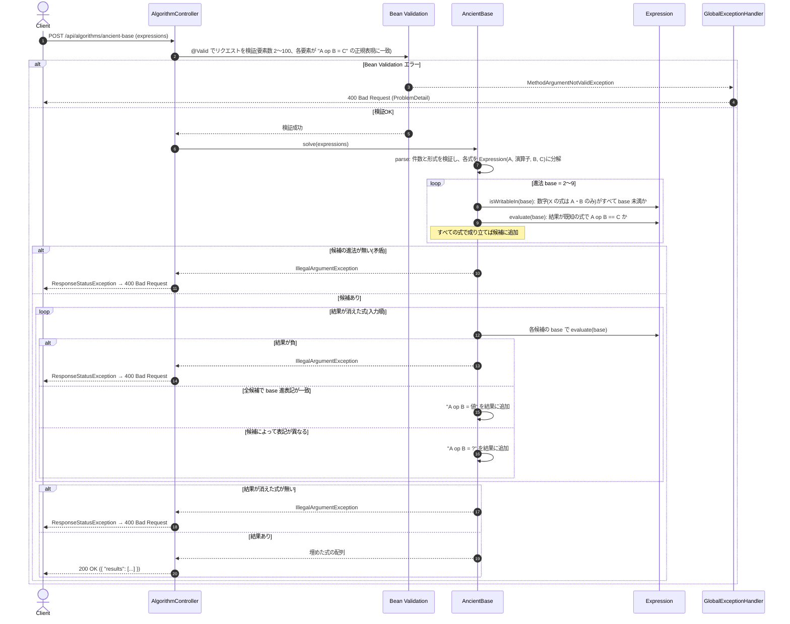

# 古代文明の進法で消えた計算結果を復元する

- **slug:** ancient-base
- **実装パッケージ:** com.example.algospeclab.algo.ancientbase
- **公開API:** `POST /api/algorithms/ancient-base`(既存 `AlgorithmController` に追加)

## 1. 問題の概要

足し算・引き算の式が複数書かれた古代文明の遺物が見つかった。この文明は 10 進法ではなく
**2〜9 進法のいずれか** を使っていた。

いくつかの式は結果が消えている(`X` で表す)。この文明の進法に合わせて、消えた結果を埋めたい。

- 式から進法を1つに特定できれば、その進法での結果を書く。
  例: `14 + 3 = 17`, `13 - 6 = X`, `51 - 5 = 44` → `51 - 5 = 44` から 8 進法と分かるので `13 - 6 = 5`。
- 進法の候補が複数あり、候補によって結果が変わる式は `?` とする。
  例: `1 + 1 = 2`, `1 + 3 = 4`, `1 + 5 = X`, `1 + 2 = X` → 候補は 6〜9 進法。
  `1 + 5` は 6 進法なら `10`、7〜9 進法なら `6` なので `1 + 5 = ?`。
  `1 + 2` はどの候補でも `3` なので `1 + 2 = 3`。

結果が消えた式を、埋めた形の文字列にして **入力の順番どおり** に返す。

## 2. 入出力の定義

### 2.1 アルゴリズム関数(algo 層)

- **クラス / メソッド:** `AncientBase.solve(String[] expressions)`
- **入力:** `expressions: String[]` — `"A + B = C"` または `"A - B = C"` 形式の式(要素数 2〜100)
  - `A`, `B`: 0 以上の2桁以下の整数(その文明の進法で書かれた数字列)
  - `C`: 英大文字 `X`(結果が消えた式)、または 0 以上の3桁以下の整数
  - 各項と記号は半角スペース1つで区切られる
- **出力:** `String[]` — 結果が消えた式(`C = X`)だけを、入力順に `"A op B = 結果"` の形にしたもの。
  結果は確定した進法での表記、候補によって異なる場合は `?`。
- **入力検証(ユーザー判断: 厳格に検証する):** 次の場合は `IllegalArgumentException` を送出する。
  - `expressions` が `null`、または要素数が 2〜100 の範囲外
  - 要素が `null`、または正規表現 `^\d{1,2} [+-] \d{1,2} = (\d{1,3}|X)$` に一致しない
  - 結果が消えた式(`X`)が1つもない
  - 候補となる進法が1つも残らない(式どうしが矛盾している、または 2〜9 進法で書けない数字 `9` を含むなど)
  - 結果が消えた式の計算結果が負になる(引き算で `A < B`)

### 2.2 REST API(controller 層)

- `POST /api/algorithms/ancient-base`
- リクエスト DTO: `AncientBaseRequest(List<String> expressions)`
  ```json
  { "expressions": ["14 + 3 = 17", "13 - 6 = X", "51 - 5 = 44"] }
  ```
- レスポンス DTO: `AncientBaseResponse(List<String> results)`
  ```json
  { "results": ["13 - 6 = 5"] }
  ```
- コントローラーは algo 層に委譲するだけでロジックは持たない。
- 単一フィールド・単一要素の制約(要素数 2〜100、各要素が上記の正規表現に一致)は Bean Validation で検証し、
  違反時は既存の `GlobalExceptionHandler` により `400` を返す。
- 式をまたぐ制約(`X` の式が無い、候補の進法が無い、結果が負)は algo 層の `IllegalArgumentException` で検出し、
  コントローラーが捕捉して `ResponseStatusException(BAD_REQUEST)` に変換する(既存課題と同じ方式)。
  捕捉範囲は `solve` の呼び出しに限定する。

## 3. 制約条件

- `2 ≤ expressions の要素数 ≤ 100`
- `A`, `B` は2桁以下、`C` は3桁以下(または `X`)
- 進法の候補は 2〜9 の 8 通り
- **時間計算量:** `O(8 × 式の数)`(候補の進法ごとに全式を検証し、`X` の式を計算する)
- **空間計算量:** `O(式の数)`

## 4. 正常系と異常系の定義 (Test Cases)

### 正常系 (Normal Cases)

- [ ] 問題例1: `["14 + 3 = 17", "13 - 6 = X", "51 - 5 = 44"]` → `["13 - 6 = 5"]`
- [ ] 問題例2: `["1 + 1 = 2", "1 + 3 = 4", "1 + 5 = X", "1 + 2 = X"]` → `["1 + 5 = ?", "1 + 2 = 3"]`
- [ ] 問題例3: `["10 - 2 = X", "30 + 31 = 101", "3 + 3 = X", "33 + 33 = X"]` → `["10 - 2 = 4", "3 + 3 = 10", "33 + 33 = 110"]`
- [ ] 問題例4: `["2 - 1 = 1", "2 + 2 = X", "7 + 4 = X", "5 - 5 = X"]` → `["2 + 2 = 4", "7 + 4 = ?", "5 - 5 = 0"]`
- [ ] 問題例5: `["2 - 1 = 1", "2 + 2 = X", "7 + 4 = X", "8 + 4 = X"]` → `["2 + 2 = 4", "7 + 4 = 12", "8 + 4 = 13"]`
      (結果が消えた式に現れる数字 `8` も進法の候補を絞る)
- [ ] 結果が消えた式しかなく候補が 2〜9 進法すべて: `["1 + 1 = X", "0 + 0 = X"]` → `["1 + 1 = ?", "0 + 0 = 0"]`
      (`1 + 1` は 2 進法だけ `10`、他は `2`)
- [ ] 2 進法に確定: `["1 + 1 = 10", "11 + 1 = X"]` → `["11 + 1 = 100"]`
- [ ] 最大の数字: `["88 + 88 = X", "1 + 1 = 2"]` → `["88 + 88 = 187"]`(数字 `8` から 9 進法に確定)

### 異常系・限界値 (Edge Cases)

- [ ] `expressions` が `null`、要素数 1、要素数 101 → `IllegalArgumentException`
- [ ] 要素が `null` → `IllegalArgumentException`
- [ ] 形式が不正(例: `"1+1 = X"`、`"1 * 1 = X"`、`"123 + 1 = X"`、`"1 + 1 = 1234"`、`"1 + 1 = x"`、`"1 + 1 = X "`)
      → `IllegalArgumentException`
- [ ] 結果が消えた式が無い: `["1 + 1 = 2", "2 + 2 = 4"]` → `IllegalArgumentException`
- [ ] 式が矛盾して候補の進法が無い: `["1 + 1 = 2", "1 + 1 = 10", "1 + 1 = X"]` → `IllegalArgumentException`
- [ ] 2〜9 進法で書けない数字を含む: `["9 + 1 = X", "1 + 1 = 2"]` → `IllegalArgumentException`
- [ ] 結果が消えた式の結果が負: `["1 - 2 = X", "1 + 1 = 2"]` → `IllegalArgumentException`

### 異常系 — REST API 層

- [ ] 正常な入力(問題例1) → `200` かつ `{ "results": ["13 - 6 = 5"] }`
- [ ] `expressions` が未指定・要素数 1・101 → `400`
- [ ] 要素の形式が不正・`null` → `400`
- [ ] 結果が消えた式が無い、候補の進法が無い、結果が負 → `400`(コントローラーが `IllegalArgumentException` を変換)

## 5. 設計のアプローチ

**採用方式: 2〜9 進法を総当たりで検証して候補を絞り、候補ごとの計算結果が一致するかで確定値か `?` かを決める**

### 5.1 処理の流れ

1. 入力を検証し、各式を `A`, 演算子, `B`, `C`(または `X`)に分解する。
2. 進法 `b = 2〜9` のそれぞれについて、次をすべて満たすものを候補として残す。
   - すべての式(結果が消えた式を含む)の `A`, `B` と、既知の `C` に現れる数字がすべて `b` 未満
     (結果が消えた式の数字も候補を絞る。例5の `8 + 4 = X` で 9 進法に確定する)
   - 結果が既知の式について、`b` 進法で解釈した `A op B` が `C` と等しい
3. 候補が1つも無ければ矛盾として `IllegalArgumentException`。
4. 結果が消えた式ごとに、各候補の進法で `A op B` を計算し、その進法の表記に戻す。
   - 負になれば `IllegalArgumentException`(下記のとおり、負になるかは進法に依存しない)
   - 全候補で表記が一致すればその値、一致しなければ `?` を結果とする。
5. 結果が消えた式を入力順に並べて返す。

### 5.2 補足

- 数字がすべて `b` 未満の数どうしの大小関係は進法に依存しない(桁数が多いほど大きく、同じ桁数なら上の桁から比べる)。
  したがって引き算の結果が負になるかどうかも進法に依存しない。
- 候補が 8 通りしかないため、全式 × 全候補を素直に検証しても十分に速い。

### 5.3 検証結果

- 設計時のプロトタイプで、問題例1〜5 と、4章の正常系に追加した3例(候補すべて・2 進法確定・最大の数字)の一致を確認済み。

## 🔄 シーケンス図 (Sequence Diagram)


