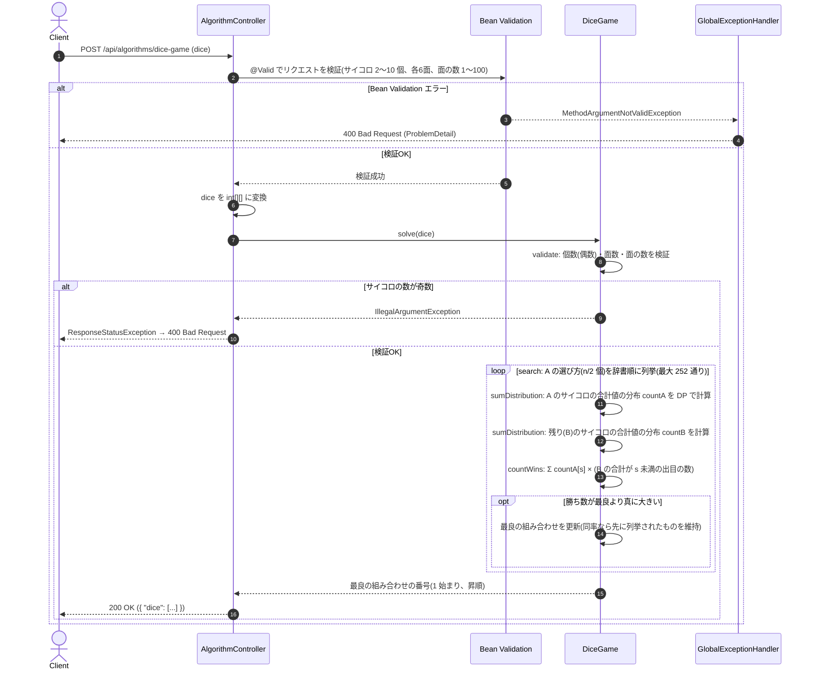

# サイコロの選び方で勝率を最大化する

- **slug:** dice-game
- **実装パッケージ:** com.example.algospeclab.algo.dicegame
- **公開API:** `POST /api/algorithms/dice-game`(既存 `AlgorithmController` に追加)

## 1. 問題の概要

A と B が `n` 個のサイコロで勝負する。各サイコロは6面にそれぞれ数が書かれ、各面が出る確率は等しい。
サイコロには 1〜n の番号があり、書かれた数の構成はすべて異なる。

1. A が先に `n / 2` 個のサイコロを取り、B が残りの `n / 2` 個を取る。
2. それぞれ取ったサイコロをすべて振り、出た数の合計を点数とする。
3. 点数が大きいほうが勝ち、同点なら引き分け。

A は **自分が勝つ確率が最も高くなる** ようにサイコロを選ぶ。A が選ぶべきサイコロの番号を昇順で返す。

例(`n = 4`)で A の選び方ごとに 6^4 = 1,296 通りの勝敗を数えると次のとおりで、`#1, #4` を選ぶと勝率が最大になる。

| A のサイコロ | 勝 | 分 | 負 |
| --- | --- | --- | --- |
| #1, #2 | 596 | 196 | 504 |
| #1, #3 | 560 | 176 | 560 |
| #1, #4 | 616 | 184 | 496 |
| #2, #3 | 496 | 184 | 616 |
| #2, #4 | 560 | 176 | 560 |
| #3, #4 | 504 | 196 | 596 |

## 2. 入出力の定義

### 2.1 アルゴリズム関数(algo 層)

- **クラス / メソッド:** `DiceGame.solve(int[][] dice)`
- **入力:** `dice: int[][]` — `dice[i]` は `i+1` 番のサイコロの6面の数(`n = dice.length` は 2〜10 の偶数、各数は 1〜100)
- **出力:** `int[]` — A が選ぶべきサイコロの番号(1 始まり、昇順、長さ `n / 2`)
- **勝率が最大の組み合わせが複数ある場合(ユーザー判断):** 原題では一意な入力のみ与えられるが、
  同率の場合は例外にせず、**番号の昇順の組み合わせを辞書順に列挙したとき最初に現れるもの** を返す
  (例: 同じ構成のサイコロが2個の `n = 2` なら `[1]`)。
- **不正入力:** 次の場合は `IllegalArgumentException` を送出する。
  - `dice` が `null`、または `n` が 2〜10 の範囲外、または奇数
  - 要素が `null`、または長さが 6 でない
  - 面の数が 1〜100 の範囲外
- 「サイコロの構成がすべて異なる」ことは検証しない(同じ構成があっても上記の同率規則で決定的に動く)。

### 2.2 REST API(controller 層)

- `POST /api/algorithms/dice-game`
- リクエスト DTO: `DiceGameRequest(List<List<Integer>> dice)`
  ```json
  { "dice": [[1, 2, 3, 4, 5, 6], [3, 3, 3, 3, 4, 4], [1, 3, 3, 4, 4, 4], [1, 1, 4, 4, 5, 5]] }
  ```
- レスポンス DTO: `DiceGameResponse(List<Integer> dice)`
  ```json
  { "dice": [1, 4] }
  ```
- コントローラーは algo 層に委譲するだけでロジックは持たない。
- 要素数(2〜10)・各サイコロの面数(6)・面の数(1〜100)は Bean Validation で検証し、
  違反時は既存の `GlobalExceptionHandler` により `400` を返す。
- 「`n` が偶数」はアノテーションで表しにくいため algo 層の `IllegalArgumentException` で検出し、
  コントローラーが捕捉して `ResponseStatusException(BAD_REQUEST)` に変換する(既存課題と同じ方式。捕捉範囲は `solve` の呼び出しに限定)。

## 3. 制約条件

- `2 ≤ n ≤ 10`、`n` は偶数、各サイコロは6面、面の数は 1〜100
- A の選び方は最大 `C(10, 5) = 252` 通り。サイコロ5個の合計は最大 `500`
- **時間計算量:** 選び方ごとに、A・B それぞれの合計値の分布を DP で求める(`O(n × 6 × 500)`)。
  勝ち数は B の分布の累積和を使って `O(500)` で数えられる。全体で約 252 × 15,000 回程度(プロトタイプで約 50ms)。
- **空間計算量:** `O(500)`(合計値の分布配列)
- 勝ち数は最大 `6^10 ≈ 6×10^7` なので `long` で扱う(`int` にも収まるが余裕を持たせる)。

## 4. 正常系と異常系の定義 (Test Cases)

### 正常系 (Normal Cases)

- [ ] 問題例1: `[[1,2,3,4,5,6],[3,3,3,3,4,4],[1,3,3,4,4,4],[1,1,4,4,5,5]]` → `[1, 4]`
- [ ] 問題例2: `[[1,2,3,4,5,6],[2,2,4,4,6,6]]` → `[2]`
- [ ] 問題例3: `[[40,41,42,43,44,45],[43,43,42,42,41,41],[1,1,80,80,80,80],[70,70,1,1,70,70]]` → `[1, 3]`
- [ ] 同率の場合は辞書順で最初の組み合わせ: `[[1,2,3,4,5,6],[1,2,3,4,5,6]]` → `[1]`、
      全面が同じ数のサイコロ4個(すべて引き分け) → `[1, 2]`
- [ ] **総当たりとの一致:** `n ≤ 6`、面の数 1〜6 程度のランダムな入力で、全出目(最大 6^6 通り)を列挙して
      勝ち数を数える総当たりと、選ばれる組み合わせが一致する(固定シードで多数回。同率時の規則も含めて比較)

### 異常系・限界値 (Edge Cases)

- [ ] 最小: `n = 2`
- [ ] 最大規模: `n = 10`、面の数 1〜100 のランダムな入力で、十分短時間(目安 1 秒以内)に長さ5の昇順配列を返す
- [ ] 面の数が最小 1・最大 100 を含む入力を正しく扱う
- [ ] `dice` が `null` → `IllegalArgumentException`
- [ ] `n` が 0、奇数(3)、12 → `IllegalArgumentException`
- [ ] 要素が `null`、面数が 5 や 7 → `IllegalArgumentException`
- [ ] 面の数が 0 や 101 → `IllegalArgumentException`

### 異常系 — REST API 層

- [ ] 正常な入力(問題例1) → `200` かつ `{ "dice": [1, 4] }`
- [ ] `dice` が未指定、要素数が 1 や 12 → `400`
- [ ] 面数が 6 でない、面の数が範囲外・`null` → `400`
- [ ] `n` が奇数(3) → `400`(コントローラーが `IllegalArgumentException` を変換)

## 5. 設計のアプローチ

**採用方式: A の選び方を全列挙し、合計値の分布(DP)から勝ち数を数えて最大のものを選ぶ**

### 5.1 処理の流れ

1. 入力を検証する。
2. サイコロの番号の組み合わせ(`n / 2` 個)を辞書順に全列挙する(最大 252 通り)。
3. 各組み合わせについて:
   1. A のサイコロの合計値の分布 `countA[s]`(合計が `s` になる出目の数)を DP で求める。
      サイコロを1個ずつ加え、`next[s + 面の数] += current[s]` を6面分行う。
   2. 残りのサイコロ(B)についても同様に `countB[s]` を求める。
   3. B の分布の累積和 `lessB[s]`(B の合計が `s` 未満になる出目の数)を作り、
      **勝ち数 = Σ_s countA[s] × lessB[s]** を計算する。
4. 勝ち数が **真に大きい** ときだけ最良を更新する(同率なら先に列挙された組み合わせが残る)。
5. 最良の組み合わせの番号(1 始まり)を昇順で返す。

### 5.2 採用理由と検証結果

- 出目をすべて列挙すると最大 6^10 ≈ 6×10^7 通り × 252 通りで重い。合計値の分布に畳み込めば、
  合計値の範囲(最大 500)に比例する計算量で済む。
- 勝率は「勝ち数 / 6^n」で分母が共通なので、勝ち数の比較で十分(浮動小数点は使わない)。
- 設計時のプロトタイプで、問題例1〜3の最良の組み合わせと、問題例1・3の表の勝・分・負の数がすべて一致することを確認済み。

## 🔄 シーケンス図 (Sequence Diagram)


