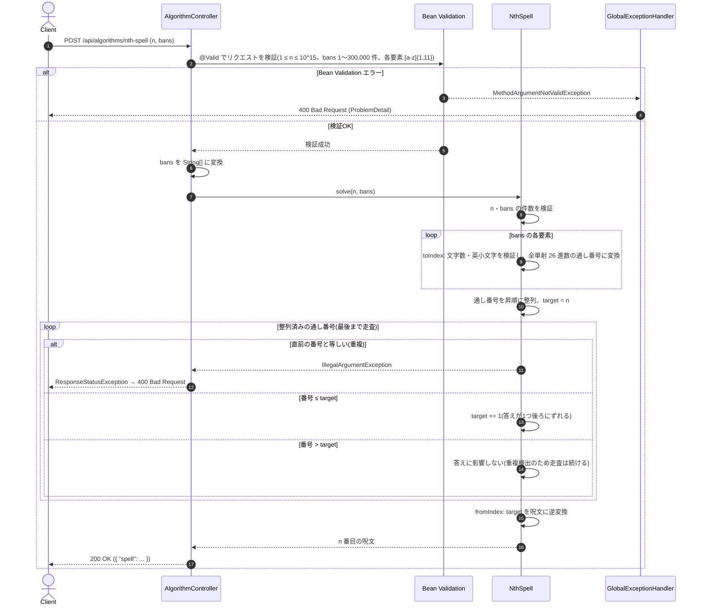

# 削除済み呪文書の n 番目の呪文

- **slug:** nth-spell
- **実装パッケージ:** com.example.algospeclab.algo.nthspell
- **公開API:** `POST /api/algorithms/nth-spell`(既存 `AlgorithmController` に追加)

## 1. 問題の概要

伝説の呪文書には、**英小文字 11 文字以下で書けるすべての文字列** が次の規則で並んでいる。

1. 文字数が少ない呪文ほど先に記録される。
2. 文字数が同じなら辞書順に記録される。

```text
"a" → "b" → … → "z"
→ "aa" → "ab" → … → "az" → "ba" → … → "zz"
→ "aaa" → … → "zzz"
→ "aaaa" → …
```

このうちいくつかの呪文(`bans`)が削除された。**削除後の呪文書で n 番目の呪文** を求める。

例: `"d", "e", "bb", "aa", "ae"` を削除したとき、30 番目の呪文は次のように `"ah"` になる。

- 1〜3 番目は `"a"`, `"b"`, `"c"`
- `"d"`, `"e"` は削除済みなので、4〜24 番目は `"f"`〜`"z"`
- `"aa"` は削除済みなので、25〜27 番目は `"ab"`, `"ac"`, `"ad"`
- `"ae"` は削除済みなので、28〜30 番目は `"af"`, `"ag"`, `"ah"`

`"bb"` のように、n 番目より後ろにあって答えに影響しない削除呪文も含まれうる。

## 2. 入出力の定義

### 2.1 アルゴリズム関数(algo 層)

- **クラス / メソッド:** `NthSpell.solve(long n, String[] bans)`
- **入力:**
  - `n: long` — 削除後の呪文書で求める順位(1 始まり、`1 ≤ n ≤ 10^15`。`int` に収まらないため `long`)
  - `bans: String[]` — 削除された呪文(英小文字のみ、長さ 1〜11、重複なし、要素数 1〜300,000)
- **出力:** `String` — 削除後の呪文書で n 番目の呪文
- **不正入力:** 次の場合は `IllegalArgumentException` を送出する。
  - `n` が `1〜10^15` の範囲外
  - `bans` が `null`、空、または要素数が 300,000 を超える
  - `bans` の要素が `null`、空文字、12 文字以上、または英小文字以外を含む
  - `bans` に同じ呪文が重複して含まれる(ユーザー判断: 重複を除去せず、制約違反として拒否する)

### 2.2 REST API(controller 層)

- `POST /api/algorithms/nth-spell`
- リクエスト DTO: `NthSpellRequest(long n, List<String> bans)`
  ```json
  { "n": 30, "bans": ["d", "e", "bb", "aa", "ae"] }
  ```
- レスポンス DTO: `NthSpellResponse(String spell)`
  ```json
  { "spell": "ah" }
  ```
- コントローラーは algo 層に委譲するだけでロジックは持たない。
- 単一フィールド・単一要素の制約(`1 ≤ n ≤ 10^15`、`bans` の要素数 1〜300,000、各要素が `[a-z]{1,11}`)は
  Bean Validation で検証し、違反時は既存の `GlobalExceptionHandler` により `400` を返す。
- 要素をまたぐ制約(`bans` の重複)は algo 層の `IllegalArgumentException` で検出し、
  コントローラーが捕捉して `ResponseStatusException(BAD_REQUEST)` に変換する(既存課題と同じ方式)。
  捕捉範囲は `solve` の呼び出しに限定する(入力は検証済みのため、ここで発生する `IllegalArgumentException` は重複のみ)。
- `bans` が最大 30 万件のとき、リクエスト本文は約 4MB になる(Spring Boot の既定設定で受け付け可能)。

## 3. 制約条件

- `1 ≤ n ≤ 10^15`
- `1 ≤ bans の要素数 ≤ 300,000`、各要素は英小文字 1〜11 文字、重複なし
- 11 文字以下の呪文の総数は `26 + 26^2 + … + 26^11 = 3,817,158,266,467,286`(約 3.8×10^15)。
  `n + bans の要素数 ≤ 10^15 + 300,000` はこれより十分小さいため、答えは必ず 11 文字以下に存在する。
- **時間計算量:** `O(B log B)`(`B` = `bans` の要素数。整列が支配的)
- **空間計算量:** `O(B)`
- 呪文の通し番号は最大約 3.8×10^15 なので `long` に収まる。

## 4. 正常系と異常系の定義 (Test Cases)

### 正常系 (Normal Cases)

- [ ] 問題例1: `n=30, bans=["d","e","bb","aa","ae"]` → `"ah"`
- [ ] 問題例2: `n=7388, bans=["gqk","kdn","jxj","jxi","fug","jxg","ewq","len","bhc"]` → `"jxk"`
- [ ] 答えより後ろの削除呪文は影響しない: `n=3, bans=["zz"]` → `"c"`
- [ ] 連続する削除呪文を順に飛ばす: `n=1, bans=["a","b","c"]` → `"d"`
      (`bans` の並び順に依存しないこと: `bans=["c","a","b"]` でも `"d"`)
- [ ] 文字数の境界をまたぐ: `n=26, bans=["a"]` → `"aa"`、`n=26, bans=["b"]` → `"aa"`
- [ ] 桁上がり: `n=52, bans=["zz"]` → `"az"`、`n=53, bans=["az"]` → `"bb"`
- [ ] **総当たりとの一致:** `n ≤ 2,000`、`bans` を通し番号 3,000 以下から最大 50 件ランダムに選んだ入力で、
      呪文を先頭から数え上げる総当たりと一致する(固定シードで多数回)

### 異常系・限界値 (Edge Cases)

- [ ] 最小: `n=1, bans=["b"]` → `"a"`、`n=1, bans=["a"]` → `"b"`
- [ ] 最大の n: `n=10^15, bans=["zzzzzzzzzzz"]` → `"gbdpxgrzxjl"`(11 文字。削除呪文は答えより後ろ)
- [ ] 最大の n で先頭を削除: `n=10^15, bans=["a"]` → `"gbdpxgrzxjm"`
- [ ] `bans` が最大件数(300,000 件)でも十分短時間(目安 1 秒以内)で完了する
- [ ] `n` が `0` 以下、または `10^15` 超過 → `IllegalArgumentException`
- [ ] `bans` が `null`、空配列、300,001 件 → `IllegalArgumentException`
- [ ] `bans` の要素が `null`、`""`、12 文字、大文字や数字を含む(例: `"A"`、`"a1"`) → `IllegalArgumentException`
- [ ] `bans` に重複がある(例: `["a","a"]`) → `IllegalArgumentException`

### 異常系 — REST API 層

- [ ] 正常な入力(問題例1) → `200` かつ `{ "spell": "ah" }`
- [ ] `n` が範囲外(`0`、`1000000000000001`) → `400`
- [ ] `bans` が未指定・空配列 → `400`
- [ ] `bans` の要素が不正(`""`、`"A"`、12 文字、`null`) → `400`
- [ ] `bans` に重複がある → `400`(コントローラーが `IllegalArgumentException` を変換)

## 5. 設計のアプローチ

**採用方式: 呪文を「全単射 26 進数」の通し番号に変換し、削除呪文の番号を昇順に見ながら n を補正する**

### 5.1 呪文と通し番号の対応

`a=1, b=2, …, z=26` として、呪文 `s` の通し番号を `Σ (s[i] の値) × 26^(len-1-i)`(全単射 26 進数)と定める。

- `"a"=1, …, "z"=26, "aa"=27, …, "zz"=702, "aaa"=703, …`
- この番号順は「文字数が少ない順 → 同じ文字数なら辞書順」という呪文書の並びと **完全に一致** する。
  したがって、削除前の呪文書で k 番目の呪文は「通し番号 k の呪文」そのもの。
- 番号から呪文への逆変換: `v` が 0 になるまで「`v -= 1` → 末尾の文字 = `'a' + v % 26` → `v /= 26`」を繰り返し、最後に反転する。

### 5.2 n 番目の求め方

1. 入力を検証し、`bans` の各要素を通し番号に変換して **昇順に整列** する(整列後に隣り合う番号が等しければ重複として拒否)。
2. 答えの通し番号の候補を `target = n` とし、削除番号を小さい順に見る。
   削除番号が `target` 以下なら、その分だけ答えは1つ後ろにずれるので `target += 1` とする。
   削除番号が `target` を超えたら、その番号は答えに影響しない。ただし答えより後ろの重複も検出するため、
   打ち切らずに最後まで走査する(整列済み配列の走査なので追加コストは `O(B)`)。
3. `target` を呪文に逆変換して返す。

昇順に処理するため、`target` を増やした結果として新たに範囲内に入る削除番号(例: `n=1, bans=["a","b","c"]`)も正しく数えられる。

### 5.3 採用理由と検証結果

- `n` は最大 10^15 なので先頭から数え上げる方法は不可能。削除呪文の数(最大 30 万)だけに比例する処理で済む本方式を採用する。
- 設計時のプロトタイプで、問題例1・2の一致と、`n ≤ 2,000`・削除 50 件以下のランダム 3,000 件で
  総当たり(先頭から数え上げ)と **完全に一致** することを確認済み。
- 11 文字以下の呪文の総数(約 3.8×10^15)と最大入力での答え(`n=10^15` → 11 文字の `"gbdpxgrzxjl"`)も同じプロトタイプで確認済み。

## 🔄 シーケンス図 (Sequence Diagram)


