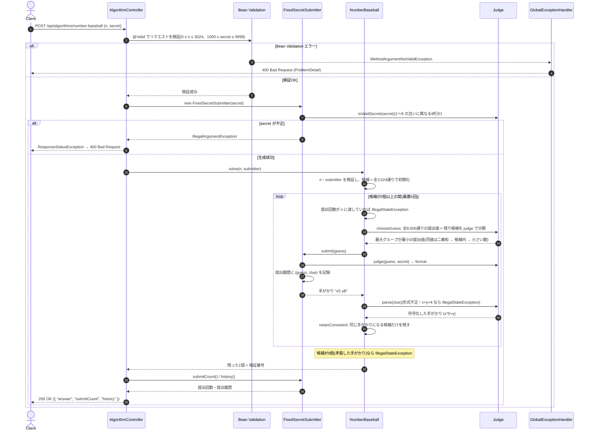

# 数字野球(最悪ケースを考慮した暗証番号の推測)

- **slug:** number-baseball
- **実装パッケージ:** com.example.algospeclab.algo.numberbaseball
- **公開API:** `POST /api/algorithms/number-baseball`(既存 `AlgorithmController` に追加)

## 1. 問題の概要

数字野球をプレイするプログラムを作成する。暗証番号は **1〜9 の互いに異なる数字4つ** からなる(候補は `9×8×7×6 = 3,024` 通り)。

`1000` 以上 `9999` 以下の整数を最大 `n` 回提出でき、提出するたびに手がかりが得られる。提出した数の各桁は次のように判定される。

- その数字が暗証番号に含まれない → OUT
- 含まれるが位置が違う → BALL
- 含まれ、位置も一致する → STRIKE

STRIKE が `x` 個、BALL が `y` 個なら、手がかりは `"xS yB"` 形式の文字列で返される。
**判定は桁ごとに独立** に行われるため、提出する数には同じ数字の重複や `0` を含めてよい。

暗証番号が `1357` の場合の例:

| 提出 | 手がかり | 説明 |
| --- | --- | --- |
| `7000` | `"0S 1B"` | 7 は含まれるが位置が違う |
| `2244` | `"0S 0B"` | どの数字も含まれない |
| `3333` | `"1S 3B"` | 位置が一致する 3 が1個、位置が違う 3 が3個 |
| `3457` | `"2S 1B"` | 5・7 は位置一致、3 は位置違い |
| `7531` | `"0S 4B"` | 4つとも含まれるが、すべて位置が違う |
| `1357` | `"4S 0B"` | 4つとも位置一致 |

`submit` を呼び出して暗証番号を特定し、それを返す。正解の条件は **`submit` の呼び出し回数が `n` 以下** で、
**正しい暗証番号を返す** こと(最後に `"4S 0B"` を受け取る必要はない)。

採点ケースには暗証番号が固定のものに加え、**`submit` を呼ぶたびに(過去の手がかりと矛盾しない範囲で)暗証番号が変わる
適応的なケース** がある。したがって最悪の場合でも `n` 回以内に1つに特定できる戦略が必要になる。

## 2. 入出力の定義

### 2.1 アルゴリズム関数(algo 層)

- **クラス / メソッド:** `NumberBaseball.solve(int n, Submitter submitter)`
- **入力:**
  - `n: int` — 提出可能な最大回数(`6 ≤ n ≤ 3,024`)
  - `submitter: Submitter` — 数を提出する関数型インターフェース(同パッケージに定義)
    ```java
    @FunctionalInterface
    public interface Submitter {
        /** guess(1000〜9999)を提出し、手がかりを "xS yB" 形式で返す。 */
        String submit(int guess);
    }
    ```
- **出力:** `int` — 暗証番号(例: `1357`)
- **不正入力・矛盾:**
  - `n` が `6〜3,024` の範囲外、または `submitter` が `null` の場合は、**1回も提出せずに** `IllegalArgumentException` を送出する。
  - 手がかりが `"xS yB"` 形式でない、`x + y > 4` などの不正な値、または過去の手がかりと矛盾して
    候補が0個になった場合は `IllegalStateException` を送出する。
  - 提出回数が `n` に達しても候補が1つに絞れない場合は、それ以上提出せず `IllegalStateException` を送出する
    (5章の戦略では最悪5回で特定できるため、制約内の入力では発生しない防御的な検査)。

### 2.2 固定暗証番号シミュレーター(algo 層)

REST API とテストで使うため、暗証番号が固定された `Submitter` 実装を同パッケージに用意する。

- **クラス:** `FixedSecretSubmitter implements Submitter`
- **コンストラクタ:** `FixedSecretSubmitter(int secret)`
  - `secret` が「1〜9 の互いに異なる4桁」でなければ `IllegalArgumentException`
- **振る舞い:** `submit(guess)` は 1章の規則で判定した `"xS yB"` を返す。
  `guess` が `1000〜9999` の範囲外なら `IllegalArgumentException`(原題の「誤答判定」に相当)。
- **記録:** 提出履歴 `List<Attempt> history()`(提出順)と提出回数 `int submitCount()` を保持する。
  `Attempt(int guess, String clue)` は同パッケージの record で、REST API のレスポンスでもそのまま使う。

### 2.3 REST API(controller 層)

対話型の問題であり、1回の HTTP リクエストで `submit` のコールバックは表現できないため、
**暗証番号を固定したシミュレーション** として公開する(既存 `treasure-excavation` と同じ方式)。

- `POST /api/algorithms/number-baseball`
- リクエスト DTO: `NumberBaseballRequest(int n, int secret)`
  ```json
  { "n": 6, "secret": 1357 }
  ```
- レスポンス DTO: `NumberBaseballResponse(int answer, int submitCount, List<Attempt> history)`
  (`Attempt` は 2.2 の algo 層の record を再利用する)
  ```json
  {
    "answer": 1357,
    "submitCount": 4,
    "history": [ { "guess": 1123, "clue": "..." }, ... ]
  }
  ```
- コントローラーは `FixedSecretSubmitter` を生成して `NumberBaseball.solve` に委譲し、ロジックは持たない。
- 単一フィールドの値域(`6 ≤ n ≤ 3,024`、`1000 ≤ secret ≤ 9999`)は Bean Validation で検証し、
  違反時は既存の `GlobalExceptionHandler` により `400` を返す。
- 「`secret` が 1〜9 の互いに異なる4桁」の検証は `FixedSecretSubmitter` の `IllegalArgumentException` で検出し、
  コントローラーが捕捉して `ResponseStatusException(BAD_REQUEST)` に変換する(既存課題と同じ方式)。

## 3. 制約条件

- `6 ≤ n ≤ 3,024`(採点グループ: `n = 3024 / 33 / 14 / 9 / 6`。最も厳しいのは `n = 6`)
- 暗証番号の候補: `3,024` 通り。提出できる数: `1000〜9999` の `9,000` 通り
- **提出回数:** 5章の戦略で **最悪5回**(全3,024通りの暗証番号で検証済み)。`n` の最小値6以内に収まる。
- **時間計算量:** 1回の提出値の選択で「提出候補 9,000 × 残り候補数」の判定を行う。
  最初の1手が最大(`9,000 × 3,024 ≈ 2.7×10^7` 回の判定)で、以降は候補数が急減する。
  `solve` 1回あたりの目安は **1秒以内**(プロトタイプで 0.6〜0.8 秒。プリミティブ配列で実装し高速化する)。
- **空間計算量:** `O(候補数)`。状態は `solve` 呼び出しごとに生成し、呼び出し間で共有しない(スレッドセーフ)。

## 4. 正常系と異常系の定義 (Test Cases)

テストでは `FixedSecretSubmitter` を使い、「返り値が暗証番号と一致」「提出回数 ≤ `n`」の2点を検証する。
`solve` 1回に1秒程度かかるため、全3,024通りの網羅はテストでは行わず、代表的な暗証番号に絞る
(全網羅での最悪5回は設計時にオフラインで検証済み。5.4 参照)。

### 正常系 (Normal Cases) — アルゴリズム関数

- [ ] 問題例1: `n=3024`、暗証番号 `1357` → `1357`
- [ ] 問題例2: `n=3024`、暗証番号 `3986` → `3986`
- [ ] 問題例3: `n=33`、暗証番号 `7685` → `7685`
- [ ] 最も厳しい `n=6` で、問題例の暗証番号(`1357`, `3986`, `7685`)と、`1234`・`9876` などの境界的な暗証番号を特定できる
- [ ] 固定シードで選んだ複数(10個程度)の暗証番号で、`n=6` かつ提出回数 ≤ 5 で特定できる
- [ ] 同じ暗証番号なら、提出する数の順序が毎回同じであること(決定性)
- [ ] 最初の提出が 5.3 のタイブレーク規則どおりの値(`1123`)であること

### 異常系・限界値 (Edge Cases) — アルゴリズム関数

- [ ] `n` が `5` 以下、または `3,025` 以上 → `IllegalArgumentException`、かつ `submit` が1回も呼ばれない
- [ ] `submitter` が `null` → `IllegalArgumentException`
- [ ] `submit` が形式不正の文字列(例: `"abc"`、`"1S"`、`null`)を返す → `IllegalStateException`
- [ ] `submit` が `x + y > 4` などの不正な値(例: `"3S 2B"`)を返す → `IllegalStateException`
- [ ] `submit` が常に `"0S 0B"` を返すなど、候補が0個になる矛盾した手がかり → `IllegalStateException`
- [ ] 手がかり `"4S 0B"` を受け取ったら、それ以降は提出せずにその提出値を返す
      (最初の提出 `1123` は暗証番号になりえないため、固定シードの複数の暗証番号で「`"4S 0B"` が現れたら最後の提出である」ことを検証する)
- [ ] `FixedSecretSubmitter`:
  - 桁に `0` を含む・同じ数字を含む・4桁でない `secret`(例: `1023`、`1123`、`999`)→ `IllegalArgumentException`
  - `guess` が `999` や `10000` → `IllegalArgumentException`
  - 1章の表(暗証番号 `1357`)の6例すべてで同じ手がかりを返す
  - 提出履歴と提出回数を記録する

### 異常系 — REST API 層

- [ ] 正常な入力(`n=6, secret=1357`) → `200` かつ `answer=1357`、`submitCount ≤ 6`、`history` の件数が `submitCount` と一致
- [ ] `n` が範囲外(`5`、`3025`) → `400`
- [ ] `secret` が範囲外(`999`、`10000`) → `400`
- [ ] `secret` が 1〜9 の互いに異なる4桁でない(`1023`、`1123`) → `400`(コントローラーが `IllegalArgumentException` を変換)

## 5. 設計のアプローチ

**採用方式: 候補集合の絞り込み + ミニマックス(最大分割サイズ最小化)による貪欲な提出値選択。毎回オンラインで計算する。**

### 5.1 候補集合の絞り込み

- 初期候補は「1〜9 の互いに異なる4桁」全3,024通り。
- 数 `g` を提出して手がかり `c` を受け取ったら、「暗証番号が `s` だったとしたら `g` の手がかりが `c` になる」
  候補 `s` だけを残す。
- 候補が1つになった時点でそれを返す(最後に `"4S 0B"` を受け取るための提出は不要)。

### 5.2 提出値の選択(ミニマックス)

各手で、提出可能な `1000〜9999` の全 9,000 通り(候補外の数、`0` や重複を含む数も対象)について、
残り候補を手がかりごとに分類したときの **最大グループのサイズ** を計算し、それが最小になる数を提出する。
適応的な採点ケースでは相手が最も大きいグループを残す手がかりを返しうるため、最大グループの最小化が最悪ケースに直結する。

- 手がかり `(x, y)` は `x × 5 + y`(0〜24)の整数に符号化して配列で数える。
- 候補外の数も提出対象にすることで、`0`(必ず OUT)を「空き桁」として使うなど、候補内の数だけを使うより細かく分割できる。

### 5.3 タイブレーク規則(決定性の確保)

最大グループのサイズが同じ場合は、次の順で決める。

1. 各グループのサイズの二乗和が小さい(期待される残り候補数が小さい)ほうを優先
2. 残り候補に含まれる数(当たれば即座に確定できる)を優先
3. それでも同じなら小さい数を優先

この規則では最初の提出は常に `1123` になる。

### 5.4 採用理由と検証結果

- 最適な決定木を厳密に探索するのは重いが、この貪欲法だけで全3,024通りを **最悪5回** で特定でき、最も厳しい `n = 6` を満たす。
- 設計時のプロトタイプで、全3,024通りについて決定木を構築し、特定までの提出回数の分布が
  2回: 2通り、3回: 285通り、4回: 2,217通り、5回: 520通り(最大5回)であることを確認済み。
- 決定的な戦略のため、適応的な採点ケースで相手が返す手がかりの列も、最終的にはある固定の暗証番号に対する手がかりの列と一致する。
  したがって固定の暗証番号全通りで最悪5回であれば、適応的なケースでも5回以内に収まる。
- ユーザー判断により、決定木のキャッシュや事前生成テーブルは使わず、`solve` のたびにオンラインで計算する
  (状態を持たずスレッドセーフで単純。代わりに1回あたり1秒弱かかる)。

## 🔄 シーケンス図 (Sequence Diagram)


