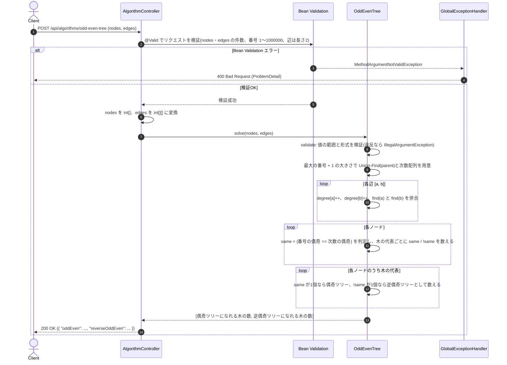

# 偶奇ツリーと逆偶奇ツリー

- **slug:** odd-even-tree
- **実装パッケージ:** com.example.algospeclab.algo.oddeventree
- **公開API:** `POST /api/algorithms/odd-even-tree`(既存 `AlgorithmController` に追加)

## 1. 問題の概要

根が決まっていない木が1つ以上ある(= フォレスト)。すべてのノードは互いに異なる番号を持つ。
根を決めると、各ノードは次の4種類のいずれかになる(0 は偶数として扱う)。

| 種類 | ノード番号 | 子ノードの数 |
| --- | --- | --- |
| 奇数ノード | 奇数 | 奇数 |
| 偶数ノード | 偶数 | 偶数 |
| 逆奇数ノード | 奇数 | 偶数 |
| 逆偶数ノード | 偶数 | 奇数 |

- **偶奇ツリー:** 奇数ノードと偶数ノードだけからなる木(= 全ノードで「番号の偶奇 = 子の数の偶奇」)
- **逆偶奇ツリー:** 逆奇数ノードと逆偶数ノードだけからなる木(= 全ノードで「番号の偶奇 ≠ 子の数の偶奇」)

各木について **根を適切に選べば** 偶奇ツリーになれるか・逆偶奇ツリーになれるかを判定し、
「偶奇ツリーになれる木の数」と「逆偶奇ツリーになれる木の数」を求める。
1つの木が両方になれる場合も、どちらにもなれない場合もある。

## 2. 入出力の定義

### 2.1 アルゴリズム関数(algo 層)

- **クラス / メソッド:** `OddEvenTree.solve(int[] nodes, int[][] edges)`
- **入力:**
  - `nodes: int[]` — フォレストのノード番号(`1〜1,000,000`、重複なし、要素数 `1〜400,000`)
  - `edges: int[][]` — 無向辺 `[a, b]` の一覧(要素数 `1〜1,000,000`)。`a`, `b` は `nodes` に含まれる互いに異なる番号
- **出力:** `int[]`(長さ2)
  - `[0]` = 偶奇ツリーになれる木の数
  - `[1]` = 逆偶奇ツリーになれる木の数
- **入力検証(ユーザー判断: 値の範囲と形式のみ検証する):** 次の場合は `IllegalArgumentException` を送出する。
  - `nodes` が `null`、空、または要素数が 400,000 を超える
  - `nodes` の要素が `1〜1,000,000` の範囲外
  - `edges` が `null`、**空**(ユーザー判断: 原題の制約「辺の数 ≥ 1」に従い拒否する)、または要素数が 1,000,000 を超える
  - `edges` の要素が `null`、長さが2でない、または端点が `1〜1,000,000` の範囲外
- **検証しないもの(制約を信頼する):** 閉路がある、`nodes` に無い番号を指す辺、自己ループ、重複辺、`nodes` の重複。
  これらを含む入力に対する結果は **未定義** とする(配列の範囲外アクセスは値の範囲検証で防ぐ)。

### 2.2 REST API(controller 層)

- `POST /api/algorithms/odd-even-tree`
- リクエスト DTO: `OddEvenTreeRequest(List<Integer> nodes, List<List<Integer>> edges)`
  ```json
  { "nodes": [11, 9, 3, 2, 4, 6], "edges": [[9, 11], [2, 3], [6, 3], [3, 4]] }
  ```
- レスポンス DTO: `OddEvenTreeResponse(int oddEven, int reverseOddEven)`
  ```json
  { "oddEven": 1, "reverseOddEven": 0 }
  ```
- コントローラーは algo 層に委譲するだけでロジックは持たない。
- 2.1 の検証項目はすべて単一フィールド・単一要素の制約なので Bean Validation で検証し、
  違反時は既存の `GlobalExceptionHandler` により `400` を返す(フィールドをまたぐ制約は検証しないため、例外変換は不要)。

## 3. 制約条件

- `1 ≤ nodes の要素数 ≤ 400,000`、`1 ≤ nodes の要素 ≤ 1,000,000`(重複なし)
- `1 ≤ edges の要素数 ≤ 1,000,000`(フォレストなので実際は `nodes の要素数 - 1` 以下)
- **時間計算量:** `O(N + E·α(N))`(`N` = ノード数、`E` = 辺の数、`α` はアッカーマン関数の逆関数。Union-Find)
- **空間計算量:** `O(V)`(`V` = ノード番号の最大値 `1,000,000`。番号を添字にした配列を使う)

## 4. 正常系と異常系の定義 (Test Cases)

### 正常系 (Normal Cases)

- [ ] 問題例1: `nodes=[11,9,3,2,4,6], edges=[[9,11],[2,3],[6,3],[3,4]]` → `[1, 0]`
- [ ] 問題例2: `nodes=[9,15,14,7,6,1,2,4,5,11,8,10]`、
      `edges=[[5,14],[1,4],[9,11],[2,15],[2,5],[9,7],[8,1],[6,4]]` → `[2, 1]`
- [ ] 1つの木が両方になれる: `nodes=[5,6], edges=[[5,6]]` → `[1, 1]`
      (5 を根にすると偶奇ツリー、6 を根にすると逆偶奇ツリー)
- [ ] どちらにもなれない木: `nodes=[9,11], edges=[[9,11]]` → `[0, 0]`
- [ ] 孤立ノードを含む: 偶数番号の孤立ノードは偶奇ツリー、奇数番号の孤立ノードは逆偶奇ツリーになる
      (`nodes=[2,5,6], edges=[[5,6]]` → `[2, 1]`、`nodes=[3,5,6], edges=[[5,6]]` → `[1, 2]`)
- [ ] **総当たりとの一致:** ノード数 12 以下のランダムなフォレスト(孤立ノードを含む)で、
      各木の全ノードを根に試して定義どおり判定する総当たりと一致する(固定シードで多数回)

### 異常系・限界値 (Edge Cases)

- [ ] 最大規模: ノード 400,000 個の1本のパス(番号は `1〜1,000,000` から選ぶ)で、十分短時間(目安 1 秒以内)に完了する
- [ ] ノード番号の最小値 `1` と最大値 `1,000,000` を含む入力を正しく扱う
- [ ] `nodes` が `null`・空配列・400,001 件 → `IllegalArgumentException`
- [ ] `nodes` の要素が `0` または `1,000,001` → `IllegalArgumentException`
- [ ] `edges` が `null`・空配列・1,000,001 件 → `IllegalArgumentException`
- [ ] `edges` の要素が `null`、長さ 1 や 3、端点が `0` または `1,000,001` → `IllegalArgumentException`

### 異常系 — REST API 層

- [ ] 正常な入力(問題例1) → `200` かつ `{ "oddEven": 1, "reverseOddEven": 0 }`
- [ ] `nodes` が未指定・空配列 → `400`
- [ ] `nodes` の要素が範囲外(`0`、`1000001`)または `null` → `400`
- [ ] `edges` が未指定・空配列 → `400`
- [ ] `edges` の要素の長さが2でない、端点が範囲外 → `400`

## 5. 設計のアプローチ

**採用方式: 「番号の偶奇と次数の偶奇が一致するノード」の数を木ごとに数える(Union-Find)**

### 5.1 根の選び方を次数だけで判定できる理由

無向木で根を決めると、各ノードの子の数は次のとおり次数(隣接ノード数)で決まる。

- 根: 子の数 = 次数
- 根以外: 子の数 = 次数 − 1(親の分を除く)

各ノードについて `same = (番号の偶奇 == 次数の偶奇)` とすると、

| | 根のとき | 根以外のとき |
| --- | --- | --- |
| 偶奇ノード(番号と子の数の偶奇が一致)になる条件 | `same` | `!same` |
| 逆偶奇ノード(偶奇が不一致)になる条件 | `!same` | `same` |

したがって、

- **偶奇ツリーになれる** ⇔ 根が `same`、それ以外がすべて `!same` ⇔ **木の中で `same` のノードがちょうど1個**(それを根にする)
- **逆偶奇ツリーになれる** ⇔ 根が `!same`、それ以外がすべて `same` ⇔ **木の中で `!same` のノードがちょうど1個**

孤立ノード(次数0)も同じ規則に従う(偶数番号なら `same` 1個で偶奇ツリー、奇数番号なら `!same` 1個で逆偶奇ツリー)。

### 5.2 処理の流れ

1. 入力の値の範囲と形式を検証する。
2. ノード番号を添字にした配列で Union-Find を初期化し、辺ごとに両端の次数を数えつつ2つの集合を併合する。
3. 各ノードについて `same` を判定し、所属する木(Union-Find の代表)ごとに `same` の数と `!same` の数を数える。
4. `same` の数が1の木を偶奇ツリー候補、`!same` の数が1の木を逆偶奇ツリー候補として数え、`[偶奇, 逆偶奇]` を返す。

### 5.3 採用理由と検証結果

- 根の候補をすべて試すと `O(N^2)` になり最大 40 万ノードでは不可能。5.1 の性質により、次数を数えるだけの `O(N + E)` で判定できる。
- 木ごとの集計には Union-Find を使う(再帰 DFS はパス状の木でスタックオーバーフローの恐れがあるため避ける)。
- 設計時のプロトタイプで、問題例1・2の一致と、ノード数 12 以下のランダムなフォレスト 5,000 件で
  総当たり(全ノードを根に試す)と **完全に一致** することを確認済み。

## 🔄 シーケンス図 (Sequence Diagram)


