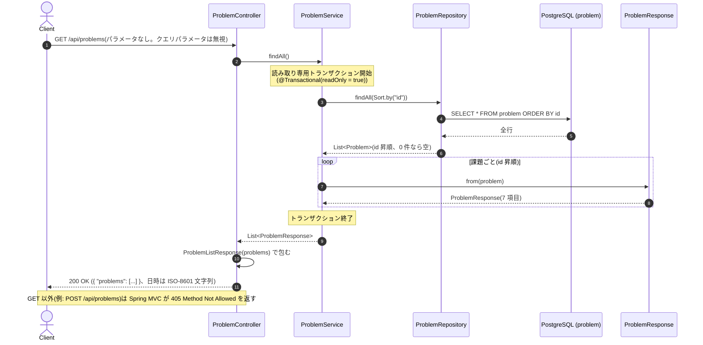

# 課題マスタの一覧を取得する

- **slug:** problem-list
- **実装パッケージ:** com.example.algospeclab.problem(ユーザー判断: DB 参照機能のため `algo/<pkg>` ではなく既存の課題マスタのパッケージに置く)
- **公開API:** `GET /api/problems`(新規 `ProblemController` を追加)

## 1. 問題の概要

`bootRun` での起動時に、`ProblemCatalogInitializer` が `AlgorithmController` の各エンドポイントと設計書
(`specs/<slug>/README.md`)から `problem` テーブル(課題マスタ)へ課題を登録・更新している。

登録済みの課題を **すべて、全項目つきで** 取得できる API を提供する。引数は取らない。

- アルゴリズム課題ではなく DB 参照機能のため、課題マスタの一覧取得は `AlgorithmController` と分けて
  新しい `ProblemController` に置く(ユーザー判断)。
- この API 自体は `AlgorithmController` の POST エンドポイントではないため、課題マスタには登録されない。

## 2. 入出力の定義

### 2.1 サービス(service 層)

- **クラス / メソッド:** `ProblemService.findAll()`
- **入力:** なし
- **出力:** `List<ProblemResponse>` — `problem` テーブルの全件を `id` の昇順で並べたもの(ユーザー判断)
  - 0 件のときは空リストを返す(例外にしない)
- 読み取り専用トランザクション(`@Transactional(readOnly = true)`)で `ProblemRepository` から取得し、
  エンティティをレスポンス DTO に変換して返す。エンティティをそのまま外に出さない。

### 2.2 REST API(controller 層)

- `GET /api/problems`
- リクエスト: パラメータ・ボディなし
- レスポンス DTO: `ProblemListResponse(List<ProblemResponse> problems)`(ユーザー判断: 既存の課題と同じくオブジェクトで包む)
- 要素 DTO: `ProblemResponse(Long id, String slug, String title, String description, String arguments, OffsetDateTime createdAt, OffsetDateTime updatedAt)`

  | 項目 | 型 | 内容 |
  | --- | --- | --- |
  | `id` | `Long` | 課題 ID(採番) |
  | `slug` | `String` | 課題の slug(`specs/<slug>` のディレクトリ名、API パスの末尾) |
  | `title` | `String` | 課題名(設計書の見出し 1) |
  | `description` | `String` | 課題説明(設計書 README.md の Markdown 全文) |
  | `arguments` | `String` | 引数(設計書のリクエスト DTO の引数リスト) |
  | `createdAt` | `OffsetDateTime` | 登録日時(ISO-8601 文字列) |
  | `updatedAt` | `OffsetDateTime` | 更新日時(ISO-8601 文字列) |

  日時のオフセットは DB(`timestamptz`)から読み込んだ値のまま出力する(PostgreSQL JDBC ドライバー経由では通常 UTC の `Z` になる)。

  ```json
  {
    "problems": [
      {
        "id": 1,
        "slug": "ancient-base",
        "title": "古代文明の進法で消えた計算結果を復元する",
        "description": "# 古代文明の進法で消えた計算結果を復元する\n\n- **slug:** ancient-base\n...",
        "arguments": "List<String> expressions",
        "createdAt": "2026-09-29T01:00:00.123456Z",
        "updatedAt": "2026-09-29T01:00:00.123456Z"
      }
    ]
  }
  ```
- コントローラーは `ProblemService` に委譲するだけでロジックは持たない。
- 入力が無いため Bean Validation・入力エラー(`400`)は無い。

## 3. 制約条件

- 課題数は `AlgorithmController` のエンドポイント数(現状 10 件程度)で、ページングは行わない。
- `description` は設計書の全文を含むため 1 件あたり数 KB になるが、件数が少ないため許容する。
- **時間計算量:** `O(n)`(n = 課題数。全件取得して DTO に変換する)
- **空間計算量:** `O(n)`

## 4. 正常系と異常系の定義 (Test Cases)

### 正常系 (Normal Cases) — サービス層

- [ ] 課題が複数件ある → 全件が `id` の昇順で返り、各要素の 7 項目がエンティティの値と一致する
- [ ] 課題が 1 件 → 1 件のリストを返す

### 異常系・限界値 (Edge Cases) — サービス層

- [ ] 課題が 0 件 → 空リストを返す(例外にしない)
- [ ] リポジトリに `id` 昇順のソート条件(`Sort.by("id")`)を渡して取得している

### REST API 層

- [ ] 課題が複数件 → `200` かつ `problems` 配列に全件が順番どおり入り、7 項目がすべて含まれる
- [ ] 課題が 0 件 → `200` かつ `{ "problems": [] }`
- [ ] `createdAt` / `updatedAt` が ISO-8601 形式の文字列で返る(数値のタイムスタンプではない)
- [ ] クエリパラメータを付けても無視して全件を返す(例: `GET /api/problems?foo=bar` → `200`)
- [ ] `POST /api/problems` → `405 Method Not Allowed`

## 5. 設計のアプローチ

**採用方式: `ProblemRepository.findAll(Sort.by("id"))` で全件を取得し、record の DTO に詰め替えて返す**

### 5.1 構成

| 層 | クラス | 役割 |
| --- | --- | --- |
| controller | `ProblemController` | `GET /api/problems` を受け、`ProblemService` に委譲して `ProblemListResponse` を返す |
| service | `ProblemService` | 読み取り専用トランザクションで全件取得し、`ProblemResponse` に変換する |
| repository | `ProblemRepository`(既存) | `JpaRepository` の `findAll(Sort)` をそのまま使う(メソッド追加なし) |
| DTO | `ProblemResponse` / `ProblemListResponse` | レスポンス用 record。`ProblemResponse.from(Problem)` で変換する |

- 配置: `ProblemController` は既存の `controller` パッケージ、それ以外は `problem` パッケージに置く。
- テスト: サービスは `src/test/java/com/example/algospeclab/problem/`(リポジトリをモックし DB 不要)、
  コントローラーは `src/test/java/com/example/algospeclab/controller/`(`@WebMvcTest` でサービスをモック)。

### 5.2 処理の流れ

1. クライアントが `GET /api/problems` を呼ぶ。
2. `ProblemController` が `ProblemService.findAll()` を呼ぶ。
3. `ProblemService` が `ProblemRepository.findAll(Sort.by("id"))` で全件を取得する。
4. 各 `Problem` を `ProblemResponse.from(problem)` で DTO に変換する。
5. `ProblemController` が `new ProblemListResponse(list)` を `200 OK` で返す。

### 5.3 補足

- エンティティを直接返さず DTO に変換するのは、JPA の遅延ロードやエンティティ変更の影響を API に漏らさないため。
- 並び順を `id` 昇順に固定するのは、DB の返却順が保証されないため(ユーザー判断)。
  初回起動時は slug の名前順で登録されるため、最初は slug 順と一致する。
- 日時は Spring Boot の既定(`WRITE_DATES_AS_TIMESTAMPS` 無効)で ISO-8601 文字列としてシリアライズされる。

## 🔄 シーケンス図 (Sequence Diagram)


