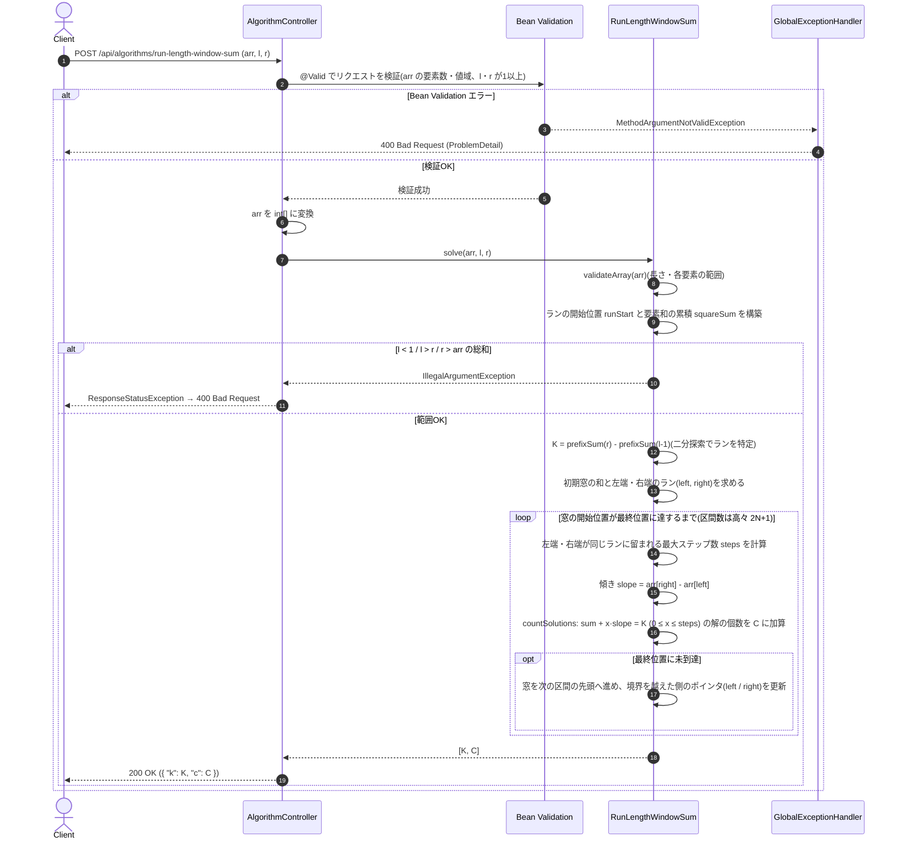

# 連長展開配列の区間和と同じ和を持つ部分配列の個数

- **slug:** run-length-window-sum
- **実装パッケージ:** com.example.algospeclab.algo.runlengthwindowsum
- **公開API:** `POST /api/algorithms/run-length-window-sum`(既存 `AlgorithmController` に追加)

## 1. 問題の概要

1以上の整数からなる長さ `N` の1次元整数配列 `arr` が与えられる。次の規則で配列 `brr` を作る。

- `arr` のインデックス順に、`arr[i]` を `brr` の末尾へ **`arr[i]` 個連続で** 追加する。
- 例: `arr = [2, 1, 5]` → `brr = [2, 2, 1, 5, 5, 5, 5, 5]`

`brr` の部分配列(連続した要素からなる配列)の両端を表す `l, r`(1始まり)が与えられたとき、次の2つを求める。

- `K` = `brr` の `l` 番目から `r` 番目までの要素の和(`brr[l-1] + brr[l] + ... + brr[r-1]`、0始まりインデックス表記)
- `C` = 長さ `r - l + 1` の `brr` の部分配列のうち、和が `K` であるものの個数(`[l, r]` 自身も含む)

`[K, C]` を返す。

## 2. 入出力の定義

### 2.1 アルゴリズム関数(algo 層)

- **クラス / メソッド:** `RunLengthWindowSum.solve(int[] arr, long l, long r)`
- **入力:**
  - `arr: int[]` — 元の配列(`1 ≤ arr[i] ≤ 100,000`)
  - `l: long` — 区間の左端(1始まり)
  - `r: long` — 区間の右端(1始まり)
  - `brr` の長さ(= `arr` の総和)は最大 `10^10` になり `int` に収まらないため、`l`・`r` は `long` とする。
- **出力:** `long[]`(長さ2)
  - `[0]` = `K`(区間和。最大 `10^15`)
  - `[1]` = `C`(和が `K` となる同じ長さの部分配列の個数。最大約 `10^10`)
- **不正入力:** 制約に違反する入力は `IllegalArgumentException` を送出する(詳細は 4章 異常系)。

### 2.2 REST API(controller 層)

- `POST /api/algorithms/run-length-window-sum`
- リクエスト DTO: `RunLengthWindowSumRequest(List<Integer> arr, long l, long r)`
  ```json
  { "arr": [3, 2, 3, 1, 1], "l": 5, "r": 7 }
  ```
- レスポンス DTO: `RunLengthWindowSumResponse(long k, long c)`
  ```json
  { "k": 8, "c": 2 }
  ```
- コントローラーは検証と algo 層への委譲のみを行い、ロジックは持たない(既存の方針を踏襲)。
- 単一フィールドの値域(`arr` の要素数・各要素の範囲、`l`・`r` が1以上)は Bean Validation で検証し、
  違反時は既存の `GlobalExceptionHandler` により `400` を返す。
- フィールドをまたぐ制約(`l ≤ r ≤ arr の総和`)は algo 層が送出する `IllegalArgumentException` で検出する。
  コントローラーがこの例外を捕捉し、`ResponseStatusException(BAD_REQUEST)` に変換して `400` を返す
  (既存 `yellow-light-sync` と同じ方式)。`IllegalArgumentException` の全域ハンドラは追加しない
  (他の処理で発生したサーバー側の不具合まで `400` に見せかけ、内部メッセージを露出させないため)。
- `K`・`C` の最大値(約 `10^15`)は JSON 数値として JavaScript の安全な整数範囲(`2^53 - 1 ≈ 9×10^15`)に収まる。

## 3. 制約条件

- `1 ≤ N = arr.length ≤ 100,000`
- `1 ≤ arr[i] ≤ 100,000`
- `brr` の全要素の和(= `Σ arr[i]^2`) `≤ 10^15`
  (`N`・`arr[i]` の上限から自動的に満たされるため、個別の検証は不要)
- `1 ≤ l ≤ r ≤ Σ arr[i]`(`brr` の長さ。最大 `10^10`)
- **時間計算量:** `O(N)`(`brr` の長さは最大 `10^10` のため、`brr` を実際に展開する方式は不可)
- **空間計算量:** `O(N)`(ラン境界の累積和配列のみ)
- オーバーフロー対策: 位置・和・個数はすべて `long` で扱う。`arr[i]^2` の計算も `long` にキャストしてから行う。

### 参考: 採点グループ(原題の構成)

| グループ | 配点 | 条件 |
| --- | --- | --- |
| #1 | 5% | `l = r` |
| #2 | 15% | `N ≤ 100`、`arr[i] ≤ 10` |
| #3 | 35% | 答えが `C = 1` のケースのみ |
| #4 | 45% | 追加制約なし |

## 4. 正常系と異常系の定義 (Test Cases)

### 正常系 (Normal Cases) — アルゴリズム関数

- [ ] 問題例1: `arr=[3,2,3,1,1], l=5, r=7` → `[8, 2]`
      (`brr=[3,3,3,2,2,3,3,3,1,1]`。5〜7番目 `[2,2,3]` と 6〜8番目 `[2,3,3]` の2つ)
- [ ] 問題例2: `arr=[2,2,2], l=2, r=2` → `[2, 6]`(`brr` の全要素が2で、長さ1の部分配列6個すべてが該当)
- [ ] 問題例3: `arr=[8,8,6,5,2,9,8,4,3,10], l=25, r=27` → `[15, 3]`
- [ ] 問題例4: `arr=[70195,25471,7389,58187,18454,90532,97667,17148,91636,2810], l=126058, r=462933` → `[27554327568, 1]`
- [ ] 問題例5: `arr=[16952,70276,16771,37992,87549,54906,36718,20478,57088,27916,51509,83422,51707,18807,80859,2673,37734,93380], l=149845, r=228204` → `[6860339640, 9190]`
- [ ] 問題例6: `arr=[49134,86806,94548,88849,95022,28334,16637,79487,23773,7314,47370,50269,36573,9415,44674,28096], l=61242, r=88535` → `[2369282964, 59513]`
- [ ] 同じ長さの別区間が同じ和になる例: `arr=[2,2,2], l=2, r=3` → `[4, 5]`
- [ ] 傾きが変化する区間で解が1つだけの例: `arr=[1,2], l=1, r=2` → `[3, 1]`(`brr=[1,2,2]`、`[2,2]` は和4)
- [ ] ランダム比較テスト: `N ≤ 8`、`arr[i] ≤ 6` 程度の小さい入力を多数生成し、
      `brr` を実際に展開して全区間を数える愚直解(テスト内のオラクル)と結果が一致すること

### 異常系・限界値 (Edge Cases) — アルゴリズム関数

- [ ] 最小入力: `arr=[1], l=1, r=1` → `[1, 1]`
- [ ] `l = r`(グループ#1相当): `arr=[3,2,3,1,1], l=4, r=4` → `[2, 2]`(値2の要素は2個)
- [ ] 全区間(`l=1, r=Σarr`): `arr=[3,2,3,1,1], l=1, r=10` → `[24, 1]`
- [ ] 最大規模・`K` の上限: `arr` を長さ `100,000`・全要素 `100,000`、`l=1, r=10^10` → `[10^15, 1]`
- [ ] 最大規模・`C` が `int` を超える: 同じ `arr`、`l=r=1` → `[100000, 10^10]`
- [ ] 最大規模の実行時間: 上記入力が十分短時間(目安1秒以内)で完了すること
- [ ] `arr` が `null` または空配列 → `IllegalArgumentException`
- [ ] `arr[i] ≤ 0` または `arr[i] > 100,000` → `IllegalArgumentException`
- [ ] `arr.length > 100,000` → `IllegalArgumentException`
- [ ] `l < 1` または `l > r` → `IllegalArgumentException`
- [ ] `r > Σ arr[i]`(`brr` の範囲外) → `IllegalArgumentException`

### 異常系 — REST API 層

- [ ] 正常な入力(問題例1) → `200` かつ `{ "k": 8, "c": 2 }`
- [ ] `arr` が `null` / 空 / 要素数 `100,000` 超過 → `400`
- [ ] `arr[i]` が範囲外(0以下、または `100,000` 超過) → `400`
- [ ] `l` または `r` が0以下 → `400`
- [ ] `l > r` → `400`(algo 層の `IllegalArgumentException` をコントローラーが `ResponseStatusException` に変換)
- [ ] `r > Σ arr[i]` → `400`(同上)

## 5. 設計のアプローチ

**採用方式: 区間和の区分線形性 + 2ポインタによるラン境界イベントの併合(`O(N)`)**

### 5.1 前処理と `K` の計算

1. ラン `i`(`arr[i]` が `arr[i]` 個並んだブロック)の開始位置を累積和で求める:
   `start[0] = 0`、`start[i+1] = start[i] + arr[i]`(`brr` 上の0始まり位置。ラン `i` は `[start[i], start[i+1])`)。
2. `brr` の先頭 `p` 要素の和 `prefix(p)` は、`p` を含むラン `i` を求めれば
   `Σ_{j<i} arr[j]^2 + (p - start[i]) × arr[i]` で計算できる(`arr[j]^2` の累積和も前処理しておく)。
3. `K = prefix(r) - prefix(l - 1)`。

### 5.2 `C` の計算(核心)

長さ `L = r - l + 1` の窓の開始位置を `s`(1始まり、`1 ≤ s ≤ S - L + 1`、`S = Σarr`)とし、窓の和を `f(s)` とする。

- 窓を1つ右へずらすと `f(s+1) = f(s) - (左端から外れる要素) + (右端に入る要素)` となる。
- 窓の **左端が同じランに留まり、かつ右端が同じランに留まる** 間は、外れる値も入る値も一定なので、
  `f` は傾き `d = arr[右端のラン] - arr[左端のラン]` の **一次関数** になる。
- 左端・右端がラン境界を越える回数はそれぞれ高々 `N` 回なので、`s` の全範囲は高々 `2N + 1` 個の線形区間に分割される。

処理の流れ:

1. 初期窓 `s = 1` の和 `f = prefix(L)` と、左端のラン `i = 0`、右端のラン `j`(位置 `L` を含むラン)を求める。
2. 現在の区間で左端・右端が同じランに留まれる最大ステップ数 `t` を求める
   (左端がラン `i` の末尾に達するまでと、右端がラン `j` の末尾に達するまでの小さい方。窓の最終位置も上限とする)。
   区間内の窓は `f, f + d, f + 2d, ..., f + t·d`(`d = arr[j] - arr[i]`)。
3. 区間内で `f + x·d = K`(`0 ≤ x ≤ t`)となる `x` の個数を数える:
   - `d = 0` の場合: `f = K` なら `t + 1` 個、そうでなければ0個。
   - `d ≠ 0` の場合: `(K - f)` が `d` で割り切れ、かつ `0 ≤ (K - f) / d ≤ t` なら1個、そうでなければ0個。
4. `f` を区間の次の窓まで進め(`f += (t + 1) × d` をベースに、境界を越えた側のランを1つ進める)、
   2ポインタ `i`・`j` を更新して 2. に戻る。窓が `S - L + 1` を越えたら終了。
5. 数えた個数の合計が `C`。

各区間の処理は `O(1)`、区間数は `O(N)` なので全体で `O(N)`(`K` 計算の二分探索を含めても `O(N + log N)`)。

### 5.3 採用理由

- `brr` の長さは最大 `10^10` あり、展開や窓の1つずつの走査(スライディングウィンドウ)は時間・メモリともに不可能。
- 「ラン内では値が一定」という構造から窓の和が区分線形になるため、区間ごとに一次方程式を解くだけで個数が数えられる。
- 境界候補を集めて整列する方式(`O(N log N)`)も可能だが、左端・右端のラン境界はそれぞれ昇順に現れるため、
  2ポインタで併合すれば整列が不要になり `O(N)` で済む。
- 設計時に、境界候補整列版の実装で問題例1〜6すべてと、小さいランダム入力3,000件に対する愚直解との一致を確認済み。

## 🔄 シーケンス図 (Sequence Diagram)


