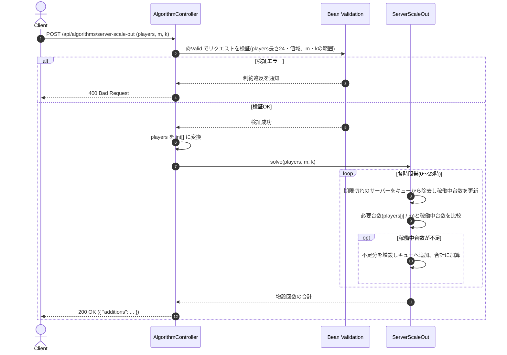

# サーバー増設回数の最小化

- **slug:** server-scale-out
- **実装パッケージ:** com.example.algospeclab.algo.serverscaleout
- **公開API:** `POST /api/algorithms/server-scale-out`(既存 `AlgorithmController` に追加)

## 1. 問題の概要

オンラインゲームを運営している。同時間帯の利用者が `m` 人増えるごとにサーバー1台の増設が必要になる。
ある時間帯の利用者が `n×m` 人以上 `(n+1)×m` 人未満なら、その時間帯には最低 `n` 台の増設サーバーが稼働していなければならない
(利用者が `m` 人未満なら増設不要)。増設したサーバーは `k` 時間だけ稼働し、その後は返却される
(例: `k=5` で10時に増設したサーバーは 10〜15時のみ稼働)。

24時間分の時間帯別利用者数が与えられたとき、1日を通して全ての時間帯の要件を満たすための
**サーバー増設回数の合計の最小値** を求める。同じ時間帯に `x` 台増設した場合、その時間帯の増設回数は `x` 回とする。

## 2. 入出力の定義

### 2.1 アルゴリズム関数(algo 層)

- **入力:**
  - `players: int[]`(長さ24。`players[i]` は `i`時〜`i+1`時の利用者数)
  - `m: int`(サーバー1台が支えられる最大利用者数)
  - `k: int`(サーバー1台の稼働時間)
- **出力:** `int` — 1日で必要な増設回数の合計(最小値)

### 2.2 REST API(controller 層)

- `POST /api/algorithms/server-scale-out`
- リクエスト DTO: `ServerScaleOutRequest(List<Integer> players, int m, int k)`
  ```json
  { "players": [0,2,3,3,1,2,0,0,0,0,4,2,0,6,0,4,2,13,3,5,10,0,1,5], "m": 3, "k": 5 }
  ```
- レスポンス DTO: `ServerScaleOutResponse(int additions)`
  ```json
  { "additions": 7 }
  ```
- コントローラーは検証と algo 層への委譲のみを行い、ロジックは持たない(既存の方針を踏襲)。
- 入力検証違反(`players` の長さ、`m`/`k` の値域など)は既存の `GlobalExceptionHandler` により `400` を返す。

## 3. 制約条件

- `players.length = 24`
- `0 ≤ players[i] ≤ 1,000`
- `1 ≤ m ≤ 1,000`
- `1 ≤ k ≤ 24`
- 時間帯数が24固定のため、時間計算量は `O(players.length)` で十分。追加のデータ構造(増設サーバーの期限管理用キュー程度)以外は不要。

## 4. 正常系と異常系の定義 (Test Cases)

### 正常系 (Normal Cases) — アルゴリズム関数

- [ ] 問題例1: `players=[0,2,3,3,1,2,0,0,0,0,4,2,0,6,0,4,2,13,3,5,10,0,1,5], m=3, k=5` → `7`
- [ ] 問題例2: `players=[0,0,0,10,0,12,0,15,0,1,0,1,0,0,0,5,0,0,11,0,8,0,0,0], m=5, k=1` → `11`
- [ ] 問題例3: `players=[0,0,0,0,0,2,0,0,0,1,0,5,0,2,0,1,0,0,0,0,0,0,0,1], m=1, k=1` → `12`

### 異常系・限界値 (Edge Cases) — アルゴリズム関数

- [ ] 全時間帯 `players[i] = 0` → `0`(増設不要)
- [ ] サーバーが**ちょうど期限切れになる時刻に再び必要人数を満たす**境界ケース
      (`players=[1,1,1,...0], m=1, k=2` → `2`。1時間目に増設したサーバーが3時間目ちょうどに期限切れになり、再増設が必要)
- [ ] `k=24`(最大、増設したサーバーが1日中稼働) かつ全時間帯で同じ台数が必要 → 最初の1回だけで済む
      (`players` を全時間帯 `1000`、`m=1000, k=24` → `1`)
- [ ] `k=1`(最小、毎時間サーバーが返却される) かつ全時間帯で同じ台数が必要 → 毎時間分だけ増設が必要になる
      (`players` を全時間帯 `1000`、`m=1000, k=1` → `24`)
- [ ] `m=1`(最小)かつ `players[i]=1000`(最大)を1時間帯だけに設定 → `1000`

### 異常系 — REST API 層

- [ ] `players` の長さが24でない場合 → `400`
- [ ] `players[i]` が範囲外(負数、または1,000超過)の場合 → `400`
- [ ] `m` が範囲外(0以下、または1,000超過)の場合 → `400`
- [ ] `k` が範囲外(0以下、または24超過)の場合 → `400`
- [ ] 正常な入力 → `200` かつアルゴリズム関数と同じ `additions` を返す

## 5. 設計のアプローチ

**採用方式: 貪欲法 + 期限管理キュー**(時間帯を先頭から順に走査し、その時点で不足している分だけを都度増設する)。

1. 各時間帯 `i` の必要サーバー台数 `required[i] = players[i] / m`(整数除算)を求める。
2. 「稼働中サーバー数」を表す `current`(初期値0)と、増設した分の期限を管理する
   キュー `queue`(`(期限切れ時刻, 台数)` のペア。期限切れ時刻の昇順)を用意する。
3. 時間帯 `i = 0 .. 23` を順に処理する:
   1. `queue` の先頭から、期限切れ時刻が `i` 以下のものを取り除き、その台数分だけ `current` を減らす。
      (`k` 時間稼働 → 時刻 `i` に増設したサーバーは時刻 `i + k` に期限切れ)
   2. `current < required[i]` なら、不足分 `need = required[i] - current` を増設する:
      `current += need`、`queue` に `(i + k, need)` を追加、増設回数の合計に `need` を加算する。
4. 全時間帯を処理したあとの増設回数の合計を返す。
5. `queue` の追加・削除は時間帯数(24)分しか発生しないため、全体で `O(players.length)` で計算できる。

### この方式が最適解になる理由

- ある時間帯で `required[i]` 台を満たすには、その時間帯に稼働中の増設サーバーが最低 `required[i]` 台必要 —
  これは避けられない下限であり、不足分を **その時間帯で増設する以外に満たす方法はない**
  (未来の増設は現在の不足を遡って解決できないため)。
- 逆に、不足していない分を先読みして余分に増設しても、後で不足が増えたときの増設回数を減らせるわけではない
  (どのみち必要な台数分は増設が必要)。したがって「不足した時点でちょうど不足分だけ増設する」貪欲法が
  常に最小回数を実現する。

## 🔄 シーケンス図 (Sequence Diagram)


