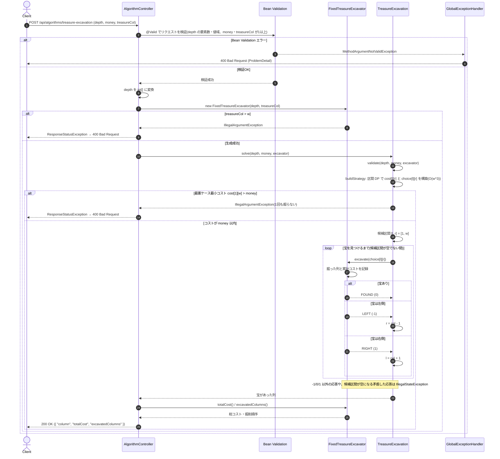

# 掘削ロボットによる宝の発掘(最悪ケース最小コスト探索)

- **slug:** treasure-excavation
- **実装パッケージ:** com.example.algospeclab.algo.treasureexcavation
- **公開API:** `POST /api/algorithms/treasure-excavation`(既存 `AlgorithmController` に追加)

## 1. 問題の概要

`w × h` の長方形格子状の土地のどこか1マスに、宝がちょうど1つ埋まっている。掘削ロボットに命令すると、
指定した列を縦方向に掘ることができる。

- 列ごとに掘削可能な最大深さ `depth[i]` が異なり、列 `col` を掘ると **その列の最大深さ分のコスト** がかかる。
- 掘った列に宝があれば宝を持ち帰る(結果 `0`)。無ければ、宝がその列の **左側にあるか(`-1`)・右側にあるか(`1`)** の情報を持ち帰る。

`excavate` 関数を呼び出して宝を見つけ、宝があった列(1始まり)を返す。正解の条件は次のすべてを満たすこと。

- 総コストが `money` を超えない
- `excavate` から少なくとも1回 `0` を受け取る(= 宝の列を実際に掘る。範囲が1列に絞れても掘る必要がある)
- 宝があった列を返す

採点ケースには宝の位置が固定のものに加え、**`excavate` を呼ぶたびに(過去の応答と矛盾しない範囲で)宝の位置が変わる
適応的なケース** がある。したがって運に頼らず、**最悪の場合でも** コストが `money` 以内に収まる戦略が必要になる。
制約により「確実に宝を見つけるための最悪ケース最小コスト ≤ `money`」が保証されている。

## 2. 入出力の定義

### 2.1 アルゴリズム関数(algo 層)

- **クラス / メソッド:** `TreasureExcavation.solve(int[] depth, int money, Excavator excavator)`
- **入力:**
  - `depth: int[]` — `depth[i]` は `i+1` 列目の掘削可能な最大深さ(= 掘削コスト)
  - `money: int` — 使用可能な総コスト(最大 `200 × 100,000 = 2×10^7` のため `int` に収まる)
  - `excavator: Excavator` — 掘削ロボットへの命令を表す関数型インターフェース(同パッケージに定義)
    ```java
    @FunctionalInterface
    public interface Excavator {
        /** col 列(1始まり)を掘る。宝を見つけたら 0、宝が左側なら -1、右側なら 1 を返す。 */
        int excavate(int col);
    }
    ```
- **出力:** `int` — 宝があった列(1始まり)
- **不正入力・矛盾:**
  - 入力が制約に違反する場合、または最悪ケース最小コストが `money` を超える場合は、
    **1回も掘らずに** `IllegalArgumentException` を送出する(事前検査)。
  - `excavate` が `-1 / 0 / 1` 以外を返した場合、または候補範囲の外側を指す応答
    (例: 候補範囲の左端の列で `-1`)を返した場合は `IllegalStateException` を送出する。

### 2.2 固定位置シミュレーター(algo 層)

REST API とテストで使うため、宝の位置が固定された `Excavator` 実装を同パッケージに用意する。

- **クラス:** `FixedTreasureExcavator implements Excavator`
- **コンストラクタ:** `FixedTreasureExcavator(int[] depth, int treasureCol)`
  - `treasureCol` が `1〜depth.length` の範囲外なら `IllegalArgumentException`
- **振る舞い:** `excavate(col)` は `col == treasureCol` なら `0`、`treasureCol < col` なら `-1`、それ以外は `1` を返す。
  `col` が `1〜w` の範囲外なら `IllegalArgumentException`(原題の「誤答判定」に相当)。
- **記録:** 掘った列の順序(`List<Integer> excavatedColumns()`)と累計コスト(`long totalCost()`)を保持する。

### 2.3 REST API(controller 層)

対話型の問題であり、1回の HTTP リクエストで `excavate` のコールバックは表現できないため、
**宝の位置を固定したシミュレーション** として公開する。

- `POST /api/algorithms/treasure-excavation`
- リクエスト DTO: `TreasureExcavationRequest(List<Integer> depth, int money, int treasureCol)`
  ```json
  { "depth": [1, 2, 3, 4, 5, 6, 7, 8, 9, 10], "money": 55, "treasureCol": 3 }
  ```
- レスポンス DTO: `TreasureExcavationResponse(int column, long totalCost, List<Integer> excavatedColumns)`
  ```json
  { "column": 3, "totalCost": 15, "excavatedColumns": [7, 5, 3] }
  ```
  (`excavatedColumns` は 5章の戦略による掘削順序。問題例1では7列 → 5列 → 3列でコスト 7+5+3=15)
- コントローラーは `FixedTreasureExcavator` を生成して `TreasureExcavation.solve` に委譲し、ロジックは持たない。
- 単一フィールドの値域(`depth` の要素数・各要素の範囲、`money`・`treasureCol` が1以上)は Bean Validation で検証し、
  違反時は既存の `GlobalExceptionHandler` により `400` を返す。
- フィールドをまたぐ制約(`treasureCol ≤ w`、最悪ケース最小コスト ≤ `money`)は algo 層の `IllegalArgumentException` で検出し、
  コントローラーが捕捉して `ResponseStatusException(BAD_REQUEST)` に変換する(既存 `run-length-window-sum` と同じ方式)。

## 3. 制約条件

- `2 ≤ w = depth.length ≤ 200`
- `1 ≤ depth[i] ≤ 100,000`
- `1 ≤ money ≤ Σ depth[i]`(`money > Σ depth` でも戦略に影響しないため、上限は検証しない)
- 確実に宝を見つけるための最悪ケース最小コスト ≤ `money`(違反時は事前検査で `IllegalArgumentException`)
- **時間計算量:** 区間 DP の構築が `O(w^3)`(`w = 200` で約 `1.3×10^6` 回の遷移)。掘削ループは最大 `w` 回。
- **空間計算量:** `O(w^2)`(DP 表と各区間の最適な掘削列)
- コストの和は最大 `2×10^7` だが、DP 値・累計コストは念のため `long` で扱う。

## 4. 正常系と異常系の定義 (Test Cases)

テストでは `FixedTreasureExcavator` を使い、「0 を受け取ったこと」「返り値が宝の列であること」「累計コスト ≤ `money`」の3点を検証する。

### 正常系 (Normal Cases) — アルゴリズム関数

- [ ] 問題例1: `depth=[1..10], money=55`、宝は3列 → `3`
- [ ] 問題例2: `depth=[1,1,1,1,1], money=3`、宝は5列 → `5`(最悪ケース最小コストがちょうど `3`)
- [ ] 問題例3: `depth=[2,100,1,100,3,100,1], money=200`、宝は6列 → `6`
- [ ] 問題例4: `depth=[2,100,1,100,3,100,1], money=200`、宝は5列 → `5`
- [ ] 問題例5: `depth=[3,2,1,2,3,2,1,2], money=8`、宝は5列 → `5`
- [ ] 問題例6: `depth=[1,1000,1,1,1,10,15,1], money=1002`、宝は2列 → `2`(最悪ケース最小コストがちょうど `1002`)
- [ ] **全位置網羅:** 問題例1〜6の各 `depth` について、宝を **すべての列** に置いた場合に正解し、累計コスト ≤ `money` であること
      (決定的な戦略では、矛盾しない適応的な応答列は最終的にある固定位置の応答列と一致するため、
      全位置の網羅で適応的な採点ケースもカバーできる)
- [ ] **最適性:** 小さい入力(`w ≤ 7`、`depth[i] ≤ 5` 程度)をランダム生成し、全位置での最大累計コストが、
      テスト内で独立に実装した総当たりのミニマックス計算の値と一致すること
- [ ] 同じ入力・同じ宝の位置なら、掘削順序が毎回同じであること(決定性)

### 異常系・限界値 (Edge Cases) — アルゴリズム関数

- [ ] 最小幅: `depth=[1,1], money=2`、宝が1列・2列のどちらでも正解
- [ ] 全要素が同じ値かつ最大規模: `depth` を長さ `200`・全要素 `100,000`、`money=800,000`
      (二分探索の深さ8 × `100,000`)で、すべての宝の位置で正解
- [ ] 最大規模の実行時間: `w = 200` のランダムな `depth` で、DP 構築と探索が十分短時間(目安1秒以内)で完了
- [ ] `money` が最悪ケース最小コスト未満: `depth=[1,1,1,1,1], money=2` → `IllegalArgumentException`、かつ `excavate` が1回も呼ばれない
- [ ] `depth` が `null`、長さ `1`、長さ `201` → `IllegalArgumentException`
- [ ] `depth[i]` が `0` 以下または `100,000` 超過 → `IllegalArgumentException`
- [ ] `money` が `0` 以下 → `IllegalArgumentException`
- [ ] `excavator` が `null` → `IllegalArgumentException`
- [ ] `excavate` が `-1 / 0 / 1` 以外(例: `2`)を返す → `IllegalStateException`
- [ ] `excavate` が常に `1`(右側)を返すなど、候補範囲の外を指す矛盾した応答 → `IllegalStateException`
- [ ] `FixedTreasureExcavator`: `treasureCol` が範囲外(`0`、`w+1`) → `IllegalArgumentException`

### 異常系 — REST API 層

- [ ] 正常な入力(問題例1) → `200` かつ `column=3`、`totalCost ≤ 55`、`excavatedColumns` の末尾が `3`
- [ ] `depth` が `null` / 要素数 `2` 未満 / `200` 超過 → `400`
- [ ] `depth[i]` が範囲外(0以下、`100,000` 超過、`null`) → `400`
- [ ] `money` または `treasureCol` が0以下 → `400`
- [ ] `treasureCol > w` → `400`(algo 層の `IllegalArgumentException` をコントローラーが変換)
- [ ] `money` が最悪ケース最小コスト未満 → `400`(同上)

## 5. 設計のアプローチ

**採用方式: 区間 DP(ミニマックス)で最適な掘削列を前計算し、応答に従って候補区間を絞り込む**

### 5.1 なぜ単純な二分探索ではだめか

全列の深さが等しければ中央を掘る二分探索が最適だが、深さが列ごとに異なると、
「安い列を多めに掘る」「高い列はなるべく掘らずに済ませる」ほうが最悪コストを下げられる
(例: 問題例6では2列目(深さ1000)を最悪でも1回だけ掘る戦略でなければ `money=1002` に収まらない)。
さらに適応的な採点ケースでは宝の位置が応答に合わせて変わるため、**最悪ケースを最小化する** 戦略が必要になる。

### 5.2 区間 DP

候補区間 `[l, r]`(1始まり、両端を含む)に宝があると分かっているとき、確実に宝を掘り当てるための
最悪ケース最小コストを `cost[l][r]` とする。

- `cost[l][r] = 0`(`l > r`、空区間)
- `cost[l][r] = min_{l ≤ k ≤ r} ( depth[k] + max(cost[l][k-1], cost[k+1][r]) )`
  - 列 `k` を掘るとコスト `depth[k]` がかかり、応答が `-1` なら `[l, k-1]`、`1` なら `[k+1, r]` に進む。
    最悪ケースでは高いほうに進むため `max` をとる。宝が `k` 列にあれば(`0`)そこで終了。
  - 1列だけの区間でも掘って `0` を受け取る必要があるため `cost[i][i] = depth[i]`(0 ではない)。
- 最小値を与えた `k` を `choice[l][r]` として保持する(同値の場合は最も左の `k` を採用し、決定性を保つ)。
- 区間の長さの昇順に計算する。全体で `O(w^3)`。

### 5.3 処理の流れ

1. 入力を検証する(`depth`・`money`・`excavator`)。
2. 区間 DP で `cost` と `choice` を構築する。
3. `cost[1][w] > money` なら、掘る前に `IllegalArgumentException` を送出する。
4. `l = 1, r = w` から開始し、次を繰り返す:
   1. `k = choice[l][r]` を掘る(`excavator.excavate(k)`)。
   2. 応答が `0` なら `k` を返す。
   3. 応答が `-1` なら `r = k - 1`、`1` なら `l = k + 1` とする。
      新しい区間が空になる応答や `-1 / 0 / 1` 以外の応答は `IllegalStateException`。
5. 各ステップで区間 `[l, r]` は `choice` の定義どおりに縮むため、累計コストは常に `cost[1][w] ≤ money` 以下に収まる。

### 5.4 採用理由

- `w ≤ 200` なので `O(w^3)` の区間 DP で十分に高速であり、最悪ケースの最適値を厳密に求められる。
- `choice` 表に従う決定的な戦略のため、固定位置・適応的のどちらの採点ケースでも最悪コストが `cost[1][w]` 以内であることが保証される。
- 設計時に、問題例1〜6について DP 値(26, 3, 105, 105, 7, 1002)がすべて `money` 以下で、
  全位置の最大コストおよび適応的な応答(残りコストが大きい側を答える敵対者)での累計コストが DP 値と一致することを確認済み。

## 🔄 シーケンス図 (Sequence Diagram)


