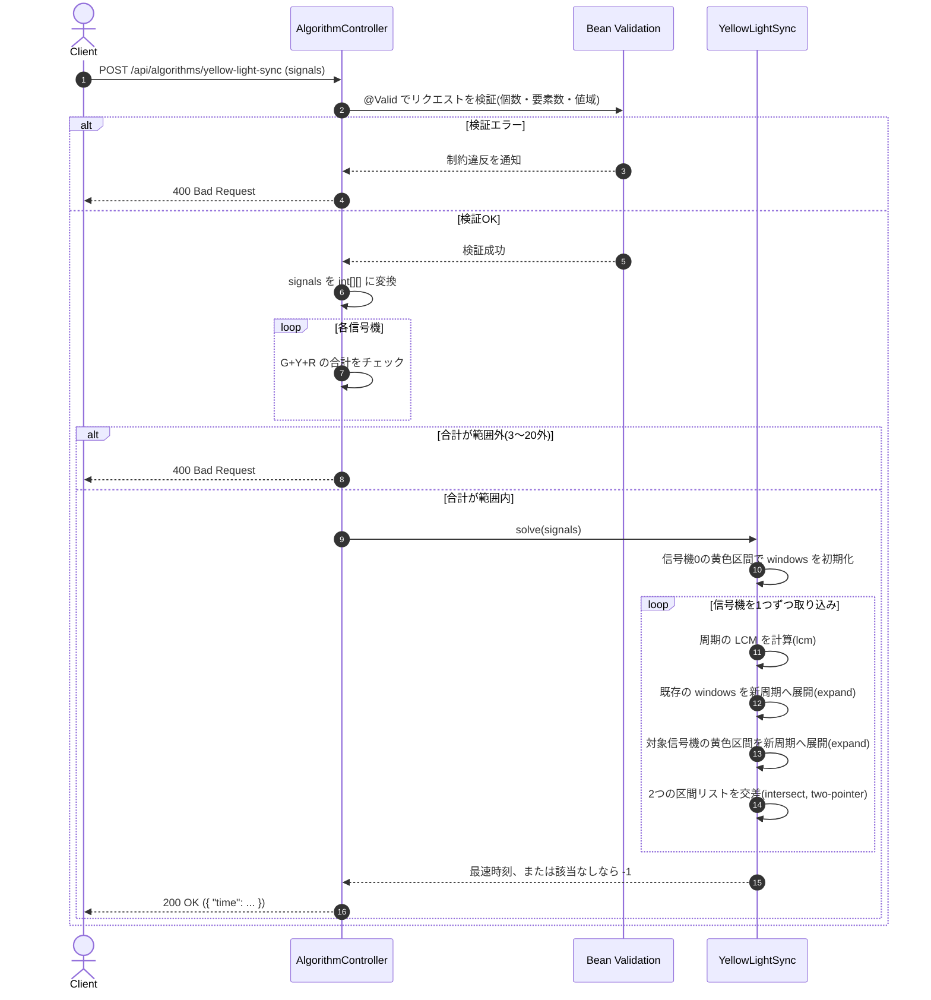

# 信号機の停電時刻(全信号機が同時に黄色になる最速時刻)

- **slug:** yellow-light-sync
- **実装パッケージ:** com.example.algospeclab.algo.yellowlightsync
- **公開API:** `POST /api/algorithms/yellow-light-sync`(既存 `AlgorithmController` に追加)

## 1. 問題の概要

道路に n 個の信号機がある。各信号機は `緑(G) → 黄(Y) → 赤(R)` の順序を無限に繰り返し、
各色の持続時間(G, Y, R)は信号機ごとに異なる。時刻は1秒から始まり、すべての信号機は1秒時点で緑の状態である。

すべての信号機が **同時に黄色** になる最も早い時刻(秒)を求める。そのような時刻が存在しない場合は `-1` を返す。

## 2. 入出力の定義

### 2.1 アルゴリズム関数(algo 層)

- **入力:** `int[][] signals`
  - `signals[i] = [G, Y, R]` — i番目の信号機の緑・黄・赤の持続時間(秒)
  - 各信号機の周期(period) = `G + Y + R`
- **出力:** `int`
  - すべての信号機が同時に黄色になる最も早い時刻(秒)。存在しない場合は `-1`。

### 2.2 REST API(controller 層)

- `POST /api/algorithms/yellow-light-sync`
- リクエスト DTO: `YellowLightSyncRequest(List<List<Integer>> signals)`
  ```json
  { "signals": [[2, 1, 2], [5, 1, 1]] }
  ```
- レスポンス DTO: `YellowLightSyncResponse(int time)`
  ```json
  { "time": 13 }
  ```
- コントローラーはリクエストを algo 層の関数に渡すだけで、ロジックは持たない(既存の `AlgorithmController` の方針を踏襲)。
- 入力検証(`signals` の要素数、各要素の長さ・値域)は `jakarta.validation` で行い、違反時は既存の `GlobalExceptionHandler` により `400` を返す。

## 3. 制約条件

- `2 ≤ signals の長さ (n) ≤ 5`
- `signals[i]` は長さ3の整数配列 `[G, Y, R]`
- `1 ≤ G, Y, R ≤ 18`
- `3 ≤ G + Y + R ≤ 20`
- 全体の信号パターンは各信号機の周期の最小公倍数(LCM)ごとに繰り返されるため、正解の候補時刻は
  `1 ~ lcm(period_1, ..., period_n)` の範囲に収まる(n ≤ 5、period ≤ 20 の条件下で最大 約92万)。
- 時間計算量の目標: 最終的な LCM を `L` として `O(L)` 以内(区間ベースの実装であれば、多くの入力でこれより大幅に少ない演算で済む)。

## 4. 正常系と異常系の定義 (Test Cases)

### 正常系 (Normal Cases) — アルゴリズム関数

- [ ] `signals=[[2,1,2],[5,1,1]]` → `13`
- [ ] `signals=[[2,3,2],[3,1,3],[2,1,1]]` → `11`
- [ ] `signals=[[3,3,3],[5,4,2],[2,1,2]]` → `193`(LCM が大きく、遅れて重なるケース)
- [ ] `n=5`(最大個数)でも正常に動作すること

### 異常系・限界値 (Edge Cases) — アルゴリズム関数

- [ ] `signals=[[1,1,4],[2,1,3],[3,1,2],[4,1,1]]` → `-1`(永遠に同時に黄色にならないケース)
- [ ] `n = 2`(最小個数)
- [ ] `G, Y, R` がそれぞれ最小値(`1`)/最大値(`18`)の境界値
- [ ] すべての信号機の周期が同一の場合(小さい結果になるケース)
- [ ] LCM が最大に近づく、互いに素に近い周期の組み合わせ(性能確認用)

### 異常系 — REST API 層

- [ ] `signals` の要素数が `1`(下限未満)または `6`(上限超過) → `400`
- [ ] `signals[i]` の要素数が `3` でない → `400`
- [ ] `G, Y, R` のいずれかが `0` または `19` 以上 → `400`
- [ ] `G + Y + R` が `3` 未満または `20` 超過 → `400`
- [ ] 正常な入力 → `200` かつアルゴリズム関数と同じ `time` を返す

## 5. 設計のアプローチ

**採用方式: 黄色区間の交差(インターバルマージ)方式**(LCM までの秒単位全探索ではなく、区間同士の交差計算で候補時刻を絞り込む)。

1. 各信号機 `i` の周期 `period[i] = G[i] + Y[i] + R[i]` と、黄色になる区間(offset基準)
   `yellow[i] = [G[i], G[i] + Y[i])` を求める。
2. `windows`(候補となる「ここまでの信号機が全部黄色」な区間の集合。offset の半開区間のリスト)を
   信号機0の `yellow[0]` で初期化し、現在の合成周期 `L = period[0]` とする。
3. 信号機 `1 .. n-1` を順に取り込みながら `windows` を更新する。信号機 `j` を取り込む際:
   1. `newL = lcm(L, period[j])`
   2. 既存の `windows`(周期 `L`)を `newL / L` 回分だけ `L` ずつずらして複製し、`[0, newL)` 全体に展開する。
   3. 信号機 `j` の `yellow[j]`(周期 `period[j]`)も同様に `newL / period[j]` 回分だけ複製し、`[0, newL)` 全体に展開する。
   4. 展開後の2つの区間リスト(いずれもソート済み・互いに非重複)を **two-pointer** で走査し、共通部分(交差区間)だけを新しい `windows` として残す。
   5. `L = newL` に更新する。
4. 全信号機を取り込み終えたあと、`windows` が空でなければ最初の区間の開始 offset に `+1`(`pos = t - 1` の補正)した値を返す。`windows` が空なら `-1` を返す。
5. `lcm(a, b) = a / gcd(a, b) * b` でオーバーフローを避けて計算し、`long` 型で扱う。
6. コントローラー(`POST /api/algorithms/yellow-light-sync`)はこの関数の戻り値をそのまま `YellowLightSyncResponse` に詰めて返すだけとする。

### この方式を選んだ理由

- 秒単位で `1 ~ L` を全部チェックする全探索よりも、「区間」を単位に扱うため処理の見通しが良く、
  黄色区間(`Y`)が広い入力では実際の演算回数が少なく済む。
- 最悪計算量は全探索と同じ `O(L)` 相当まで悪化しうるが(区間数が周期比に比例して増える場合)、
  本問題の制約(`n ≤ 5`, `period ≤ 20`)では十分高速。
- 区間マージという汎用的なテクニックのため、将来的に制約が緩和されても方式自体は流用しやすい。

## 🔄 シーケンス図 (Sequence Diagram)


